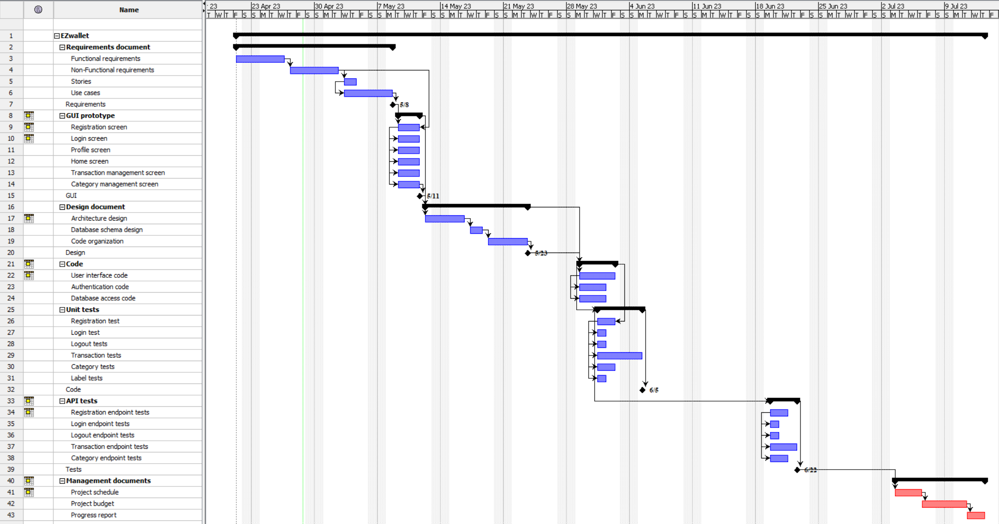

# Project Estimation - CURRENT
Date: 28-04-2023

Version: 1.1.2

# Estimation approach
Consider the EZWallet  project in CURRENT version (as received by the teachers), assume that you are going to develop the project INDEPENDENT of the deadlines of the course
# Estimate by size
### 
|             | Estimate                        |             
| ----------- | :-------------------------------: |
| NC =  Estimated number of modules to be developed                                                         |8|          
| A = Estimated average size per module, in LOC                                                             |163| 
| S = Estimated size of project, in LOC (= NC * A)                                                          |1300| 
| E = Estimated effort, in person hours (here use productivity 10 LOC per person hour)                      |130|   
| C = Estimated cost, in euro (here use 1 person hour cost = 30 euro)                                       |3900| 
| Estimated calendar time, in calendar weeks (Assume team of 4 people, 8 hours per day, 5 days per week )   | 1 |               

### Modules: documents, app, controllers, db, models, routes, server, test.
### We have included on the calculation *.js files LOCs + *V1.md files LOCs
----------------------------------------------------------------------------
# Estimate by product decomposition
### 
|         component name    | Estimated effort (person hours)   |             
| ----------- | :-------------------------------: | 
| requirement document | 96 |
| GUI prototype | 24 |
| design document | 64 |
| code | 32 |
| unit tests | 24 |
| api tests | 24 |
| management documents | 64 |

# Estimate by activity decomposition
### 
|         Activity name    | Estimated effort (person hours)   |             
| ----------- | :------------------------------: | 
| ***Requirements*** | 96 |
|- Functional requirements| 32 |
|- Non Functional requirements| 32 |
|- Stories | 32 |
|- Use cases | 32 |
| ***GUI prototipe*** | 24 |
|- Registration screen | 24 |
|- Login screen | 24 |
|- Home Screen | 24 |
|- Transaction management screen | 24 |
|- Category management screen | 24 |
|- Label management screen | 24 |
| ***Design document*** | 64 |
|- Architecture design  | 24 |
|- Databease schema design | 16 |
|- Code organization | 24 |
| ***Code*** | 32 |
|- User interface code | 32 |
|- Authentication code | 24 |
|- Database access code | 24 |
| ***Unit tests*** | 24 |
|- Registration test | 12 |
|- Login test | 8 |
|- Logout test | 8 |
|- Transaction tests | 24 |
|- Category tests | 16 | 
|- Label tests | 8 |
| ***API tests*** | 24 |
|- Registration endpoint tests | 16 |
|- Login endpoint tests | 8 |
|- Logout endpoint tests | 8 |
|- Transaction endpoint tests | 24 |
|- Category endpoint tests | 16 |
| ***Management documents*** | 64 |
|- Project schedule | 24 |
|- Project budget | 24 |
|- Project report | 16 |

###

# Summary

Report here the results of the three estimation approaches. The  estimates may differ. Discuss here the possible reasons for the difference

|             | Estimated effort                        |   Estimated duration |          
| ----------- | :-------------------------------: | :---------------:|
| estimate by size | 130 person hours | 4 days |
| estimate by product decomposition | 328 person hours | 10 days |
| estimate by activity decomposition | 536 person hours | 17 days |

The calculations performed are based on the code given to us. In the estimation by LOCs we have considered only the *.js files and the *V1.md documents: it is based solely on the numbers of lines of code, without taking into account other factors such as the number of features, the complexity of the code and the skill level of the developement team. This approach assumes that the amount of effort required to complete a project is directly proportional to the LOCs, which means that may not be always accurate. We have assumed that external libraries are not to be included to the calculations and there are no acquisition costs for them. On the other hand, the estimation by Product/Activity break down the project into smaller and manageable tasks and estimate the effort required to complete each one. They consider a wider range of factors that can affect the project's complexity and duration, indeed those two approaches are generally more accurate compared to the first one.

Assumptions: in all the estimation approaches, we have team of 4 people that works 8 hours per day, 5 days per week.