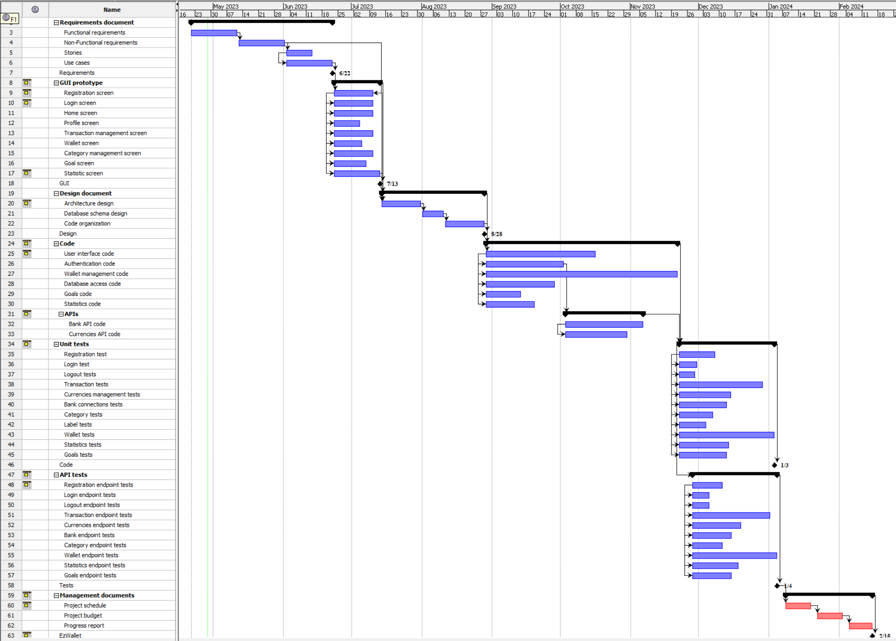

# Project Estimation - FUTURE
Date: 28-04-2023

Version: 1.0.5

# Estimation approach
Consider the EZWallet  project in FUTURE version (as proposed by the team), assume that you are going to develop the project INDEPENDENT of the deadlines of the course
# Estimate by size
### 
|             | Estimate                        |             
| ----------- | :-------------------------------: |
| NC =  Estimated number of modules to be developed                                                         |8|          
| A = Estimated average size per module, in LOC                                                             |8400| 
| S = Estimated size of project, in LOC (= NC * A)                                                          |16800| 
| E = Estimated effort, in person hours (here use productivity 10 LOC per person hour)                      |1680|   
| C = Estimated cost, in euro (here use 1 person hour cost = 30 euro)                                       |54400| 
| Estimated calendar time, in calendar weeks (Assume team of 4 people, 8 hours per day, 5 days per week )   | 11 |               
### Modules: documents, app, controllers, db, models, routes, server, test.

# Estimate by product decomposition
### 
|         component name    | Estimated effort (person hours)   |             
| ----------- | :-------------------------------: | 
| requirement document | 360 |
| GUI prototype | 120 |
| design document | 256 |
| code | 488 |
| unit tests | 240 |
| api tests | 200 |
| management documents | 232 |

# Estimate by activity decomposition
### 
|         Activity name    | Estimated effort (person hours)   |             
| ----------- | :------------------------------: | 
| ***Requirements*** | 360 |
|- Functional requirements| 120 |
|- Non Functional requirements| 120 |
|- Stories | 64 |
|- Use cases | 120 |
| ***GUI prototipe*** | 120 |
|- Registration screen | 96 |
|- Login screen | 96 |
|- Home screen | 96 |
|- Profile screen | 64 |
|- Transaction management screen | 96 |
|- Wallet screen | 112 |
|- Category management screen | 96 |
|- Goal screen | 88 |
|- Statistics screen | 120 |
| ***Design document*** | 256 |
|- Architecture design  | 96 |
|- Databease schema design | 64 |
|- Code organization | 96 |
| ***Code*** | 488 |
|- User interface code | 280 |
|- Authentication code | 200 |
|- Wallet management code | 480 |
|- Database access code | 184 |
|- Goal code | 96 |
|- Statistics code | 128 |
|- ***API*** | 200 |
|-- Bank API code | 200 |
|-- Currencies API code | 160 |
| ***Unit tests*** | 240 |
|- Registration test | 96 |
|- Login test | 48 |
|- Logout test | 40 |
|- Transaction tests | 216 |
|- Currencies management tests | 136 |
|- Bank connection tests | 120 |
|- Category tests | 88 |
|- Label tests | 64 |
|- Wallet tests | 240 |
|- Statistics tests | 128 |
|- Goal tests | 120 |
| ***API tests*** | 224 |
|- Registration endpoint test | 80 |
|- Login endpoint test | 48 |
|- Logout endpoint test | 48 |
|- Transaction endpoint tests | 200 |
|- Currencies endpoint tests | 128 |
|- Bank endpoint tests | 112 |
|- Category endpoint tests | 80 |
|- Wallet endpoint tests | 224 |
|- Statistics endpoint tests | 120 |
|- Goal endpoint tests | 112 |
| ***Management documents*** | 232 |
|- Project schedule | 80 |
|- Project budget | 80 |
|- Project report | 72 |
###

# Summary

Report here the results of the three estimation approaches. The  estimates may differ. Discuss here the possible reasons for the difference

|             | Estimated effort                        |   Estimated duration |          
| ----------- | :-------------------------------: | :---------------: |
| estimate by size | 1680 person hours | 55 days |
| estimate by product decomposition | 1896 person hours | 62 days |
| estimate by activity decomposition | 5960 person hours | 190 days |

Estimation by size: based on the code that we have and the functionalities that we have added, we tried to estimate the number of lines of code when the project will be finished. The calculations are based solely on the numbers of lines of code, without taking into account other factors such as the number of features, the complexity of the code and the skill level of the developement team. As a consequence, this method can be inaccurate.
Estimation by Product decomposition and Activity decomposition, on the other hand, break down the project into smaller and manageable tasks and estimate the effort required to complete each one. They consider a wider range of factors that can affect the project's complexity and duration, indeed those two approaches are generally more accurate compared to the first one.

Assumptions: in all the estimation approaches, we have team of 4 people that works 8 hours per day, 5 days per week.

