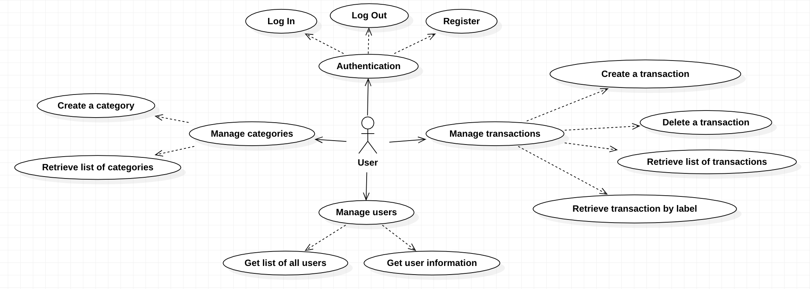

# Requirements Document - current EZWallet

Date: 12-04-2023

Version: V1 - description of EZWallet in CURRENT form (as received by teachers)

 
| Version number | Change |
| :-----------------: |:-----------:|
| 1.2.0 | 10 | 

# Contents

- [Informal description](#informal-description)
- [Business model](#business-model)
- [Stakeholders](#stakeholders)
- [Context Diagram and interfaces](#context-diagram-and-interfaces)
	+ [Context Diagram](#context-diagram)
	+ [Interfaces](#interfaces) 
	
- [Stories and personas](#stories-and-personas)
- [Functional and non functional requirements](#functional-and-non-functional-requirements)
	+ [Functional Requirements](#functional-requirements)
	+ [Non functional requirements](#non-functional-requirements)
- [Use case diagram and use cases](#use-case-diagram-and-use-cases)
	+ [Use case diagram](#use-case-diagram)
	+ [Use cases](#use-cases)
- [Glossary](#glossary)
- [System design](#system-design)
- [Deployment diagram](#deployment-diagram)
- [Defects](#defects)

# Informal description
EZWallet (read EaSy Wallet) is a software application designed to help individuals and families keep track of their expenses. Users can enter and categorize their expenses, allowing them to quickly see where their money is going. EZWallet is a powerful tool for those looking to take control of their finances and make informed decisions about their spending.

# Business Model
This application is being developed as an open-source project. The project aims to become a self-hosted solution for users who want to manage their expenses without relying on any commercial product that may be more at risk of potential data leaks or, without the user knowing, may sell their information online. 

The community behind the project is composed of developers that work on the application in their free time. The owners of the repository on gitlab are the project leaders that guide the other developers towards predefined goals during the development phase. To support them a small bank account has been setted up to accept donations by users.

The user who sets up the application has full rights on transactions and categories created and can grant more privileges to normal users. Normal users can login and track their expenses.

# Stakeholders

| Stakeholder name  | Description | 
| :----------------- |:-----------|
| User | Someone who will use the application to keep track of his expenses | 
| System administrator | User who has special privileges over the functions performed by the application (currently the system doesn't distinguish between roles so it isn't an actor) |

# Context Diagram and interfaces

## Context Diagram

## Interfaces

| Actor | Logical Interface | Physical Interface  |
| ------------- |:-------------| -----|
| User | PC/Smartphone | GUI (tdb + key functions: managing transactions and categories) |

# Stories and personas

### Persona 1 (P1): female, 23 y.o., student, low income, not married.  
Interacts with the application through a web browser on her phone.  
Story: wants to keep track of her expenses grouped by type.

### Persona 2 (P2): male, 51 y.o., worker, high income, married.  
Interacts with the application through a web browser on his laptop.  
Story: wants to track household expenses with his wife and children, such as rent, school tuition, food, electrical bills, etc.

### Persona 3 (P3): male, old age, retired, low income, married.  
Interacts with the application through a web browser on his desktop computer.  
Story: wants to keep track of how his pension is used during the month in order to have the needed amount for medicines.

### Persona 4 (P4): female, 28 y.o., worker, medium income, not married. 
Interacts with the application through a web browser on her phone.  
Story: wants to keep track of travel expenses.

### Persona 5 (P5): other, young age, part-time worker, low income, not married.  
Interacts with the application through a web browser on its phone.  
Story: wants to keep track of expenses to keep paying its school.

### Persona 6 (P6): male, young age, worker, medium income, not married.  
Interacts with the application through a web browser on his phone.  
Story: wants to keep track of expenses related to his ski hobby.

# Functional and non functional requirements

## Functional Requirements

| ID        | Description  |
| ------------- |:-------------| 
| FR1 | Manage transactions |
| FR2 | Manage categories |
| FR3 | Manage users | 
| FR4 | Authentication |

## Non Functional Requirements

| ID | Type (efficiency, reliability, ..) | Description | Refers to |
| ------------- |:-------------| :-----| :-----|
| NFR1 | Usability | Core functions for users should be used with no training, only with previous experience with smartphones | FR1, FR2, FR4 |
| NFR2 | Availability | Max. Server downtime 1 hr / year | FR1, FR2, FR3, FR4 |
| NFR3 | Security | Authorize users access | FR3 |
| NFR4 | Efficiency | All functions should be completed in less than 2 seconds | FR1, FR2, FR3, FR4 | 
| NFR5 | Portability | Application can be run independently of the operating system/device by having a web interface | FR1, FR2, FR3, FR4 | 
| NFR6 | Correctness | Transactions should be managed correctly without errors to avoid having wrong informations recorded | FR1 | 

# Use case diagram and use cases

## Use case diagram

## Use cases
### UC1: Login
| User       |  |
| ------------- |:-------------| 
|  Precondition   | User must have an account |
|  Post condition | User is authorized |
|  Nominal Scenario | Scenario 1.1  |
|  Variants     | - |
|  Exceptions     | - User is already logged in  - User’s account doesn't exist  - Wrong credentials  -  Connection to the DB fails |
| Post condition (exception case) | User not authorized |

| Scenario 1.1 | |
| ------------- |:-------------| 
|  Precondition     | User must have an account |
|  Post condition     | User is authorized |
| # Step        | Description  |
|  1 | User asks to login |  
|  2 | System asks email and password |
|  3 | User enters email and password |
|  4 | System checks if account name and password are correct |
|  5 | Server sends two cookies to the client that contain an access and a refresh token respectively:   - Access token has an expiration time of one hour   - Refresh token has an expiration time of seven days |

### UC2: Register
| User        |  |
| ------------- |:-------------| 
|  Precondition   | User must not have an account |
|  Post condition | Account is created |
|  Nominal Scenario | Scenario 2.1  |
|  Variants     | - |
|  Exceptions     | - User is already registered  - Connection to the DB fails |
| Post condition (exception case) | Account not created |

| Scenario 2.1 | |
| ------------- |:-------------| 
|  Precondition     | User must not have an account |
|  Post condition     | Account is created |
| # Step        | Description  |
|  1 | User asks to sign up |  
|  2 | System asks for email and checks if email has already been used by another user |
|  3 | System asks for password and username |
|  4 | User enters username and password |
|  5 | System created account |

### UC3: Logout
| User        |  |
| ------------- |:-------------| 
|  Precondition   | User must be logged in |
|  Post condition | User is logged out |
|  Nominal Scenario | Scenario 3.1  |
|  Variants     | - |
|  Exceptions     | - User already logged out  - User’s session expired (7 days)  - User not found  - Connection to the DB fails |
| Post condition (exception case) | Log out action not performed |

| Scenario 3.1 | |
| ------------- |:-------------| 
|  Precondition     | User must have an account and must be logged in |
|  Post condition     | User is logged out |
| # Step        | Description  |
|  1 | User asks to log out |  
|  2 | User’s device checks if access and refresh tokens exist |
|  3 | System checks if refresh token exists |
|  4 | System erases access and refresh tokens from user’s account |

### UC4: Create a transaction
| User        |  |
| ------------- |:-------------| 
|  Precondition   | User must be logged in |
|  Post condition | Transaction created |
|  Nominal Scenario | Scenario 4.1  |
|  Variants     | - |
|  Exceptions     | - User not authorized  - Transaction already exists  - Connection to the DB fails |
| Post condition (exception case) | Transaction not created |

| Scenario 4.1 | |
| ------------- |:-------------| 
|  Precondition | User must be logged in |
|  Post condition | Transaction created |
| # Step        | Description  |
|  1 | User asks the system to create a transaction |
|  2 | System asks for transaction informations |
|  3 | User enters name, amount, and type |  
|  4 | System creates new transaction |

### UC5: Delete a transaction
| User        |  |
| ------------- |:-------------| 
|  Precondition   | User must be logged in |
|  Post condition | Transaction deleted |
|  Nominal Scenario | Scenario 5.1  |
|  Variants     | - |
|  Exceptions     | - User not authorized  - Transaction doesn't exist  - Connection to the DB fails |
| Post condition (exception case) | Transaction not deleted |

| Scenario 5.1 | |
| ------------- |:-------------| 
|  Precondition | User must be logged in |
|  Post condition | Transaction deleted |
| # Step        | Description  |
|  1 | User asks the system to delete a transaction |
|  2 | System asks which transaction should be deleted |
|  3 | User enters transaction's ID |  
|  4 | System deletes transaction |

### UC6: Retrieve list of transactions
| User        |  |
| ------------- |:-------------| 
|  Precondition   | User must be logged in |
|  Post condition | Transaction data are retrieved |
|  Nominal Scenario | Scenario 6.1  |
|  Variants     | - |
|  Exceptions     | - User not authorized  - Connection to the DB fails |
| Post condition (exception case) | Transaction's list not retrieved |

| Scenario 6.1 | |
| ------------- |:-------------| 
|  Precondition | User must be logged in |
|  Post condition | Transaction data are retrieved |
| # Step        | Description  |
|  1 | User asks list of transactions |  
|  2 | System gets transactions |

### UC7: Create category
| User        |  |
| ------------- |:-------------| 
|  Precondition   | User must be logged in |
|  Post condition | Category created |
|  Nominal Scenario | Scenario 7.1  |
|  Variants     | - |
|  Exceptions     | - User not authorized  - Category already exists  - Connection to the DB fails |
| Post condition (exception case) | Category not created |

| Scenario 7.1 | |
| ------------- |:-------------| 
|  Precondition | User must be logged in |
|  Post condition | Category created |
| # Step        | Description  |
|  1 | User asks the system to create a category |
|  2 | System asks about category informations |
|  3 | User enters type and color |  
|  4 | System check if already present |
|  5 | System creates new category |

### UC8: Retrieve list of categories
| User        |  |
| ------------- |:-------------| 
|  Precondition   | User must be logged in |
|  Post condition | Categories are retrieved |
|  Nominal Scenario | Scenario 8.1  |
|  Variants     | - |
|  Exceptions     | - User not authorized  - Connection to the DB fails |
| Post condition (exception case) | Categories not retrieved |

| Scenario 8.1 | |
| ------------- |:-------------| 
|  Precondition | User must be logged in |
|  Post condition | Categories are retrieved |
| # Step        | Description  |
|  1 | User asks the system the list of categories |  
|  2 | System retrieves all categories created by user |

### UC9: Retrieve transaction by label
| User        |  |
| ------------- |:-------------| 
|  Precondition   | User must be logged in |
|  Post condition | List of transactions more detailed retrieved |
|  Nominal Scenario | Scenario 9.1  |
|  Variants     | - |
|  Exceptions     | - User not authorized  - Connection to the DB fails |
| Post condition (exception case) | Detailed transactions not retrieved |

| Scenario 9.1 | |
| ------------- |:-------------| 
|  Precondition | User must be logged in |
|  Post condition | List of transactions retrieved |
| # Step        | Description  |
|  1 | User asks for a list of transactions grouped with category's informations |  
|  2 | System gets transactions and links them with category's informations |

### UC10: Get list of all users
| User        |  |
| ------------- |:-------------| 
|  Precondition   | User must be logged in |
|  Post condition | List of users retrieved |
|  Nominal Scenario | Scenario 10.1  |
|  Variants     | - |
|  Exceptions     | - User not authorized  - Connection to the DB fails |
| Post condition (exception case) | List of users not retrieved |

| Scenario 10.1 | |
| ------------- |:-------------| 
|  Precondition | User must be logged in |
|  Post condition | List of users retrieved |
| # Step        | Description  |
|  1 | User asks to the system to get all users |  
|  2 | System returns all users list |

### UC11: Get user information
| User        |  |
| ------------- |:-------------| 
|  Precondition   | User must be logged in |
|  Post condition | Information about the user retrieved |
|  Nominal Scenario | Scenario 11.1  |
|  Variants     | - |
|  Exceptions     | - User not authorized  - Connection to the DB fails |
| Post condition (exception case) | User informations not retrieved |

| Scenario 11.1 | |
| ------------- |:-------------| 
|  Precondition | User must be logged in |
|  Post condition | Information about the user retrieved  |
| # Step        | Description  |
|  1 | User asks to the system to get his profile information |  
|  2 | System returns the user information |

# Glossary

# System Design

# Deployment Diagram 

# Defects
The application, as given to us, presents some defects, visible in the different modules that compose it:
- The getUsers functionality should be used only by administrators to correctly manage them. Instead this function can be called by any non-logged user, creating a vulnerability in the system and allowing anyone to see and use sensible data related to the different users.
- The getUserByUsername should return only informations about the researched user. Instead every user can call it but the informations they can get are only related to themselves.
- The get_labels method doesn't return all the informations between a transaction and its related category: the color is missing, making the join between tables useless.
- The create_Categories method doesn't check during the creation process if a category was previously inserted. So, duplicate categories can be created and cannot be distinguished by a normal user.
- Every user can get the list of all transactions, including the ones that haven't been created or edited by the user itself. This happens because the get_transactions method doesn't perform checks on user identity.