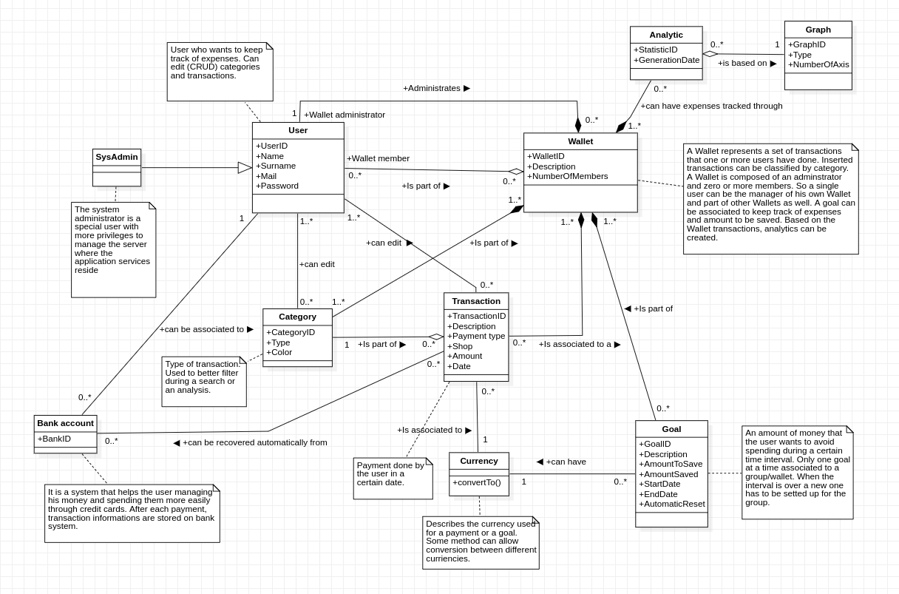

# Requirements Document - future EZWallet

Date: 

Version: V2 - description of EZWallet in FUTURE form (as proposed by the team)

 
| Version number | Change |
|:-----------------:|:-----------:|
| 1.0.3 | 4 | 

# Contents

- [Informal description](#informal-description)
- [Business model](#business-model)
- [Stakeholders](#stakeholders)
- [Context Diagram and interfaces](#context-diagram-and-interfaces)
	+ [Context Diagram](#context-diagram)
	+ [Interfaces](#interfaces) 
	
- [Stories and personas](#stories-and-personas)
- [Functional and non functional requirements](#functional-and-non-functional-requirements)
	+ [Functional Requirements](#functional-requirements)
	+ [Non functional requirements](#non-functional-requirements)
- [Use case diagram and use cases](#use-case-diagram-and-use-cases)
	+ [Use case diagram](#use-case-diagram)
	+ [Use cases](#use-cases)
    	+ [Relevant scenarios](#relevant-scenarios)
- [Glossary](#glossary)
- [System design](#system-design)
- [Deployment diagram](#deployment-diagram)

# Informal description
EZWallet (read EaSy Wallet) is a software application designed to help individuals and families keep track of their expenses. Users can enter and categorize their expenses, allowing them to quickly see where their money is going. EZWallet is a powerful tool for those looking to take control of their finances and make informed decisions about their spending.

# Business model
This application is being developed as an open-source project. The project aims to become a self-hosted solution for users who want to manage their expenses without relying on any commercial product that may be more at risk of potential data leaks or, without the user knowing, may sell their information online. 

The community behind the project is composed of developers that work on the application in their free time. The owners of the repository on gitlab are the project leaders that guide the other developers towards predefined goals during the development phase. To support them a small bank account has been setted up to accept donations by users.

The user who sets up the service on the server has elevated privileges and can modify transactions, categories and user accounts' informations in order to intervene in case problems arise. Users can access the service through their browser to register or login and start tracking their expenses, eventually inside a Wallet composed of other individuals. 

The system allows users to link the application to their bank account, in order to recover previous transaction informations, without having the need to input them manually.

# Stakeholders

| Stakeholder name  | Description | 
|:----------------- |:----------- |
| Project leader    | Owner of the project. He guides and supports other project developers towards realizing the intended functionalities. | 
| Project developer | He contributes in developing the application. |
| Donator 			| He donates to the project because he wants to support its continuing development. |
| User		 		| General user belonging to the project-related community that makes use of the service and talks about it. He registers or logins to the application to make use of its services and can edit his profile informations that are available to other registered users. He can see other registered users on the service instance and contact them. He can have three different roles: "System administrator", "Wallet administrator" and "Wallet user". |
| System administrator | He sets up the application on a server so that the users can make use of EZWallet services. He has elevated privileges on the server instance, allowing him to solve problems during critical situations. |
| Wallet administrator  | Owner of one or more wallets. He manages a wallet by configuring it, adding transactions and categories. He can ask other users to join his wallet. |
| Wallet user | Member of a wallet. He can add, edit and request the deletion of one or more transactions and categories. |
| Bank system | APIs used to get transactions informations automatically. |
| Currency converter system | APIs used to perform conversions between different currencies. |

# Context Diagram and interfaces

## Interfaces
| Actor | Physical Interface | Logical Interface  |
|:------|:------------------|:--------------------|
| Project leader | PC | GUI (tbd + all functions + debug features) |
| Project developer | PC | GUI (tbd + all functions + debug features) |
| System administrator | PC | GUI (tbd + all functions + management of users and Wallets  + configuration of server instance) |
| Wallet administrator | PC/Smartphone | GUI (tbd + all functions + management of Wallet settings) |
| Wallet member | PC/Smartphone | GUI (tbd + all functions) |
| Bank system | Internet connection | APIs |
| Currency converter system | Internet connection | APIs |

# Stories and personas

### Persona 1 (P1): female, 23 y.o., student, low income, not married.  
Interacts with the application through a web browser on her phone.  
Story: wants to keep track of common expenses with housemates (electrical/internet bills, food, cleaning products…) to correctly split payments.

### Persona 2 (P2): male, 51 y.o., worker, high income, married.  
Interacts with the application through a web browser on his desktop pc.  
Story: wants to track household expenses with his wife and children, such as rent, school tuition, food, electrical bills, etc. and get alerts if they are exceeding their budget.

### Persona 3 (P3): male, old age, retired, low income, married.  
Interacts with the application through a web browser on his desktop pc.  
Story: wants to keep track of how his pension is used during the month in order to have the needed amount for medicines.

### Persona 4 (P4): female, 28 y.o., worker, medium income, not married.  
Interacts with the application through her laptop's browser.  
Story: wants to keep track of travel expenses with a group of friends in order to avoid spending too much money.  

### Persona 5 (P5): other, young age, part-time worker, medium income, not married.  
Interacts with EZWallet's services through its smartphone's browser.  
Story: wants to keep track of expenses to make sure it can keep paying its school tuition.  

### Persona 6 (P6): male, young age, worker, medium income, not married.  
Interacts with the services by using his laptop's browser.  
Story: wants to keep track of expenses related to his ski hobby.  

### Persona 7 (P7): male, middle age, worker , high income, divorced.  
Interacts with the application through a browser on his desktop pc.  
Story: wants to keep track of travel expenses of his tour to Japan.

# Functional and non functional requirements

## Functional Requirements
| ID        | Description  |
|-----------|:-------------| 
|  FR1      | Manage transactions |
|  FR2      | Manage currencies	  |
|  FR3 		| Handle bank accounts | 
|  FR4		| Manage categories |
|  FR5		| Handle goals |
|  FR6 		| Create statistics |
|  FR7		| Manage users |
|  FR8		| Manage Wallets |
|  FR9		| Authentication |

## Non Functional Requirements
| ID | Type (efficiency, reliability, ..) | Description | Refers to |
| ------------- |:-------------| :-----| :-----|
| NFR1 | Usability | Core functions for users should be used with no training, only with previous experience with smartphones/PCs | FR1, FR3, FR4, FR5, FR7, FR8, FR9 |
| NFR2 | Availability | Max. Server downtime 1 hr / year | FR1, FR2, FR3, FR4, FR5, FR6, FR7, FR8, FR9 |
| NFR3 | Security | Authorize users access,   Manage data privacy | FR3, FR9 |
| NFR4 | Efficiency | All functions should be completed in less than 2 seconds | FR1, FR2, FR3, FR4, FR5, FR6, FR7, FR8, FR9 | 
| NFR5 | Portability | Application can be run independently of the operating system/device by having a web interface | FR1, FR2, FR3, FR4, FR5, FR6, FR7, FR8, FR9 | 
| NFR6 | Correctness | Actions should be managed correctly without errors to avoid having wrong informations or wrong authorization informations recorded | FR1, FR2, FR3, FR8 | 

# Use case diagram and use cases

## Use case diagram

### UC1: Login
| User        |  |
| ------------- |:-------------:| 
|  Precondition     | User must have an account |
|  Post condition     | User is authorized |
|  Nominal Scenario     | Scenario 1.1 |
|  Variants     | - |
|  Exceptions     | - User already logged in - Account dosen't exist  - Invalid credentials -Connection to DB failed  |

| Scenario 1.1 | |
| ------------- |:-------------:| 
|  Precondition     | User must have an account |
|  Post condition     | User is authorized |
| Step#        | Description  |
|  1 | User asks to login |
|  2 | System asks for email and password |
|  3 | User enters email and password |
|  4 | System check if account name and password are correct. |
|  5 | User is authorized |

### UC2: Register
| User        |  |
| ------------- |:-------------:| 
|  Precondition     | User must not have an account |
|  Post condition     | Account created |
|  Nominal Scenario     | Scenario 2.1 |
|  Variants     | - |
|  Exceptions     | - User already registered - Invalid email -Connection to DB failed |

| Scenario 2.1 | |
| ------------- |:-------------:| 
|  Precondition     | User must have an account |
|  Post condition     | User is authorized |
| Step#        | Description  |
|  1 | User asks to sign up |
|  2 | System asks for email and password |
|  3 | User enters email and password |
|  4 | System checks if email is already used |
|  5 | System asks for name, surname, and username |
|  6 | User enters name, surname, and username |
|  7 | Systems creates account |

### UC3: Logout
| User        |  |
| ------------- |:-------------:| 
|  Precondition     | User must have an account and must be logged in |
|  Post condition     | User is logged out |
|  Nominal Scenario     | Scenario 3.1 |
|  Variants     | - |
|  Exceptions     | - User already logged out (invalid tokens) - User's session expired (7 days) - User not found - Connection to DB failed |

| Scenario 3.1 | |
| ------------- |:-------------:| 
|  Precondition     | User must have an account and must be logged in |
|  Post condition     | User is logged out |
| Step#        | Description  |
|  1 | User asks to log out |
|  2 | User’s device checks if access and refresh tokens exist |
|  3 | System checks if refresh token exists |
|  4 | System erases access and refresh tokens from user’s account |
|  5 | User is logged out |

### UC4: Delete Account
| User        |  |
| ------------- |:-------------:| 
|  Precondition     | User must have an account and must be logged in |
|  Post condition     | User's account is deleted |
|  Nominal Scenario     | Scenario 4.1 |
|  Variants     | - |
|  Exceptions     | - User already logged out (invalid tokens) - User's session expired (7 days) - User not found - User not authorized - Connection to DB failed - Incorrect password |

| Scenario 4.1 | |
| ------------- |:-------------:| 
|  Precondition     | User must have an account and must be logged in |
|  Post condition     | User is logged out |
| Step#        | Description  |
|  1 | User asks to delete account |
|  2 | User’s device checks if access and refresh tokens exist |
|  3 | System checks if refresh token exists |
|  4 | System asks for password and user's confirmation |
|  5 | User enters password |
|  6 | System checks if password is correct |
|  7 | System deletes account and refresh tokens from user’s account |
|  8 | User is logged out |
|  9 | System deletes account |

### UC5: Create a transaction
| User        |  |
| ------------- |:-------------:| 
|  Precondition     | User must be logged in and has to be part of at least one wallet, regardless of his role |
|  Post condition     | Transaction pending for review (Member) Transaction created (Admin) |
|  Nominal Scenario     | Scenario 5.1 (Member) Scenario 5.2 (Admin) |
|  Variants     | - |
|  Exceptions     | - Currency conversion failed - Category dosen't exist - Wallet not found - User not authorized - Connection to DB failed |

| Scenario 5.1 | |
| ------------- |:-------------:| 
|  Precondition     | User must have an account, be logged in, and member of a wallet |
|  Post condition     | Transaction pending for review |
| Step#        | Description  |
|  1 | User asks to create a transaction |
|  2 | System prompts to the user a form where transaction information needs to be inserted |
|  3 | User enters name, amount, type, payment type, currency, wallet |
|  4 | System converts to wallet’s default currency |
|  5 | Systems adds transaction to pending for review transactions |

| Scenario 5.2 | |
| ------------- |:-------------:| 
|  Precondition     | User must have an account, be logged in, and administrator of a wallet |
|  Post condition     | Transaction created |
| Step#        | Description  |
|  1 | User asks to create a transaction |
|  2 | System prompts to the user a form where transaction information needs to be inserted |
|  3 | User enters name, amount, type, payment type, currency, wallet |
|  4 | System converts to wallet’s default currency |
|  5 | Systems creates new transaction |
|  6 | System updates goal information (if available) and checks if goal is reached |
|  7 | Transaction created |

### UC6: Delete a transaction
| User        |  |
| ------------- |:-------------:| 
|  Precondition     | User must be logged in and is part of the wallet, regardless of his role |
|  Post condition     | Transaction pending for review (Member) Transaction deleted (Admin) |
|  Nominal Scenario     | Scenario 6.1 (Member) Scenario 6.2 (Admin) |
|  Variants     | - |
|  Exceptions     | - User not authorized (e.g. tokens are wrong) - Connection to DB failed |

| Scenario 6.1 | |
| ------------- |:-------------:| 
|  Precondition     | User must be logged in and is part of the wallet as a member |
|  Post condition     | Transaction pending for review |
| Step#        | Description  |
|  1 | User asks the system to delete a transaction |
|  2 | System prompts the user with all the transactions available to him |
|  3 | User selects transaction to delete |
|  4 | System adds transaction to wallet’s pending for review transactions |

| Scenario 6.2 | |
| ------------- |:-------------:| 
|  Precondition     | User must be logged in and have to be part of at least one wallet as an admin |
|  Post condition     | Transaction deleted |
| Step#        | Description  |
|  1 | User asks the system to delete a transaction |
|  2 | System prompts the user with all the transactions available to him |
|  3 | User selects transaction to delete |
|  4 | System deletes transaction |
|  5 | System updates goal information (if available) and checks if goal is reached |

### UC7: Edit transaction
| User        |  |
| ------------- |:-------------:| 
|  Precondition     | User must be logged in and is part of the wallet, regardless of his role |
|  Post condition     | Transaction pending for review (User) Transaction updated (Admin) |
|  Nominal Scenario     | Scenario 7.1 (User) Scenario 7.2 (Admin) |
|  Variants     | - |
|  Exceptions     | - User not authorized - Can't convert amount to default currency - Connection to DB failed |

| Scenario 7.1 | |
| ------------- |:-------------:| 
|  Precondition     | User must be logged in and is part of the wallet |
|  Post condition     | Transaction pending for review |
| Step#        | Description  |
|  1 | User asks to edit a transaction |
|  2 | System prompts the user with all transactions available to him |
|  3 | User selects transaction to edit |
|  4 | User modifies name, amount, type, payment type, currency, wallet |
|  5 | If currency was modified, system converts to wallet’s default currency |
|  6 | System adds transaction to wallet’s pending for review transactions |

| Scenario 7.2 | |
| ------------- |:-------------:| 
|  Precondition     | User must be logged in and have to be part of at least one wallet |
|  Post condition     | Transaction updated |
| Step#        | Description  |
|  1 | Admin asks to edit a transaction |
|  2 | System prompts the admin with all transactions available |
|  3 | Admin selects transaction to edit |
|  4 | Admin modifies name, amount, type, payment type, currency, wallet |
|  5 | If amount or currency was modified, system updates goal information (if available) and checks if goal is reached |
|  6 | System updates the transaction |

 ### UC8: Retrieve Transactions
| User        |  |
| ------------- |:-------------:| 
|  Precondition     | User must be logged in and is part of the wallet, regardless of his role |
|  Post condition     | Transactions retrieved |
|  Nominal Scenario     | Scenario 8.1 |
|  Variants     | - |
|  Exceptions     | - User not authorized (e.g. tokens are wrong) - Connection to DB failed |

| Scenario 8.1 | |
| ------------- |:-------------:| 
|  Precondition     | User must be logged in and is part of the wallet, regardless of his role |
|  Post condition     | Transactions retrieved |
| Step#        | Description  |
|  1 | User selects wallet |
|  2 | System gets transactions related to the wallet |
|  3 | Transactions retrieved |

### UC9: Filter Transactions
| User        |  |
| ------------- |:-------------:| 
|  Precondition     | User must be logged in and have to be part of at least one wallet, regardless of his role |
|  Post condition     | Transactions retrieved |
|  Nominal Scenario     | Scenario 9.1 |
|  Variants     | - |
|  Exceptions     | - User not authorized (e.g. tokens are wrong) - Connection to DB failed |

| Scenario 9.1 | |
| ------------- |:-------------:| 
|  Precondition     | User must be logged in and has to be part of the wallet, regardless of his role |
|  Post condition     | Transactions retrieved |
| Step#        | Description  |
|  1 | User selects filter |
|  2 | System asks the user which filter should be applied |
|  3 | User enters type of the filter (category, amount) and enters details for the filter to use |
|  4 | System retrieves transactions based on filter |
|  5 | Transactions retrieved |

### UC10: Retrieve Pending Transactions
| User        |  |
| ------------- |:-------------:| 
|  Precondition     | User must be logged in and wallet admin |
|  Post condition     | Pending transactions retrieved |
|  Nominal Scenario     | Scenario 10.1 |
|  Variants     | - |
|  Exceptions     | - User not authorized (e.g. tokens are wrong) - Connection to DB failed |

| Scenario 10.1 | |
| ------------- |:-------------:| 
|  Precondition     | User must be logged in and wallet admin |
|  Post condition     | Pending transactions retrieved |
| Step#        | Description  |
|  1 | User selects wallet |
|  2 | System gets pending for review transactions |
|  3 | Pending transactions retrieved |

### UC11: Verify Pending Transaction
| User        |  |
| ------------- |:-------------:| 
|  Precondition     | User must be logged in and is part of the wallet as its administrator |
|  Post condition     | Transaction created |
|  Nominal Scenario     | Scenario 11.1 |
|  Variants     | - |
|  Exceptions     | - User not authorized (e.g. tokens are wrong) - Connection to DB failed |

| Scenario 11.1 | |
| ------------- |:-------------:| 
|  Precondition     | User must be logged in and is part of the wallet as its administrator |
|  Post condition     | Transaction created |
| Step#        | Description  |
|  1 | User asks the system for pending transactions |
|  2 | System gets list of pending transactions |
|  3 | User selects a transaction |
|  4 | System asks for confirmation |
|  5 | System adds transaction to wallet’s transactions, updates goal information (if available), and checks if goal is reached |
|  6 | Transaction created |

### UC12: Delete Pending Transaction
| User        |  |
| ------------- |:-------------:| 
|  Precondition     | User must be logged in and is part of the wallet as its administrator |
|  Post condition     | Transaction deleted |
|  Nominal Scenario     | Scenario 12.1 |
|  Variants     | - |
|  Exceptions     | - User not authorized (e.g. tokens are wrong) - Connection to DB failed |

| Scenario 12.1 | |
| ------------- |:-------------:| 
|  Precondition     | User must be logged in and is part of the wallet as its administrator |
|  Post condition     | Transaction deleted |
| Step#        | Description  |
|  1 | User asks the system for pending transactions to be deleted |
|  2 | System gets list of pending transactions to be deleted |
|  3 | User selects a transaction |
|  4 | System asks for confirmation of deletion |
|  5 | System deletes transaction |
|  6 | Transaction deleted |

### UC13: Create Category
| User        |  |
| ------------- |:-------------:| 
|  Precondition     | User must be logged in and is part of the wallet, regardless of its role |
|  Post condition     | Category created |
|  Nominal Scenario     | Scenario 13.1 |
|  Variants     | - |
|  Exceptions     | - User not authorized - Connection to DB failed |

| Scenario 13.1 | |
| ------------- |:-------------:| 
|  Precondition     | User must be logged in and is part of the wallet, regardless of its role |
|  Post condition     | Category created |
| Step#        | Description  |
|  1 | User asks the system to create a category |
|  2 | System prompts the user for details about the category |
|  3 | User enters type and color |
|  4 | System creates new category |
|  5 | Category created |

### UC14: Edit Category
| User        |  |
| ------------- |:-------------:| 
|  Precondition     | User must be logged in and is part of the wallet, regardless of its role |
|  Post condition     | Category updated |
|  Nominal Scenario     | Scenario 14.1 |
|  Variants     | - |
|  Exceptions     | - User not authorized - Connection to DB failed |

| Scenario 14.1 | |
| ------------- |:-------------:| 
|  Precondition     | User must be logged in and is part of the wallet, regardless of its role |
|  Post condition     | Category updated |
| Step#        | Description  |
|  1 | User asks the system to edit a category |
|  2 | System prompts the user for selecting the category |
|  3 | User selects category |
|  4 | System gets category information |
|  5 | User modifies type, color, and then confirms |
|  6 | System updates category |
|  7 | Category updated |

### UC15: Delete Category
| User        |  |
| ------------- |:-------------:| 
|  Precondition     | User must be logged in and is part of the wallet, regardless of its role |
|  Post condition     | Category deleted |
|  Nominal Scenario     | Scenario 15.1 |
|  Variants     | - |
|  Exceptions     | - User not authorized - Category not found - Connection to DB failed |

| Scenario 15.1 | |
| ------------- |:-------------:| 
|  Precondition     | User must be logged in and is part of the wallet, regardless of its role |
|  Post condition     | Category deleted |
| Step#        | Description  |
|  1 | User asks the system to delete a category |
|  2 | System prompts the user for selecting the category |
|  3 | User selects category |
|  4 | System asks for confirmation |
|  5 | User confirms |
|  6 | System deletes category |
|  7 | Category deleted |

### UC16: Retrieve Categories
| User        |  |
| ------------- |:-------------:| 
|  Precondition     | User must be logged in and is part of the wallet, regardless of its role |
|  Post condition     | Categories retrieved |
|  Nominal Scenario     | Scenario 16.1 |
|  Variants     | - |
|  Exceptions     | - User not authorized (e.g. tokens are wrong) - Connection to DB failed |

| Scenario 16.1 | |
| ------------- |:-------------:| 
|  Precondition     | User must be logged in and is part of the wallet, regardless of its role |
|  Post condition     | Categories retrieved |
| Step#        | Description  |
|  1 | User asks the system for a list of categories |
|  2 | System gets categories |
|  3 | Categories are retrieved |

### UC17: Retrieve Transaction by Label
| User        |  |
| ------------- |:-------------:| 
|  Precondition     | User must be logged in and is part of the wallet, regardless of its role |
|  Post condition     | List of transactions retrieved |
|  Nominal Scenario     | Scenario 17.1 |
|  Variants     | - |
|  Exceptions     | - User not authorized (e.g. tokens are wrong) - Connection to DB failed |

| Scenario 17.1 | |
| ------------- |:-------------:| 
|  Precondition     | User must be logged in and have to be part of at least one wallet, regardless of its role |
|  Post condition     | List of transactions retrieved |
| Step#        | Description  |
|  1 | User asks for a list of transactions with their associated categories |
|  2 | System gets transactions with their associated categories |
|  3 | List of transactions is retrieved |

### UC18: Get All Users
| User        |  |
| ------------- |:-------------:| 
|  Precondition     | User must be logged in |
|  Post condition     | System returns all users list |
|  Nominal Scenario     | Scenario 18.1 |
|  Variants     | - |
|  Exceptions     | - User not authorized - Connection to DB failed |

| Scenario 18.1 | |
| ------------- |:-------------:| 
|  Precondition     | User must be logged in |
|  Post condition     | System returns all users list |
| Step#        | Description  |
|  1 | User asks the system to get all users |
|  2 | System returns all users list |

### UC19: Get User Information
| User        |  |
| ------------- |:-------------:| 
|  Precondition     | User must be logged in |
|  Post condition     | System returns the user's information |
|  Nominal Scenario     | Scenario 19.1 |
|  Variants     | - |
|  Exceptions     | - User not authorized - Connection to DB failed |

| Scenario 19.1 | |
| ------------- |:-------------:| 
|  Precondition     | User must be logged in |
|  Post condition     | System returns the user information |
| Step#        | Description  |
|  1 | User asks the system to get his profile information based on his username |
|  2 | System returns the user's information |

### UC20: Get user wallets

| User        |  |
| ------------- |:-------------:| 
|  Precondition     | User must be logged in |
|  Post condition     | System returns the user's wallets |
|  Nominal Scenario     | Scenario 20.1 |
|  Variants     | - |
|  Exceptions     | - User not authorized - Connection to DB failed |

| Scenario 20.1 | |
| ------------- |:-------------:| 
|  Precondition     | User must be logged in |
|  Post condition     | System returns the user's wallets |
| Step#        | Description  |
|  1 | User asks to the system to get the wallets based on his username |
|  2 | System checks that the user is the same as the username |
|  3 | System returns the user's wallets |

### UC21: Authorize bank access

| User        |  |
| ------------- |:-------------:| 
|  Precondition     | User must be logged in |
|  Post condition     | System is authorized to access the user's transactions |
|  Nominal Scenario     | Scenario 21.1 |
|  Variants     | - |
|  Exceptions     | - User not authorized - Connection fails - Bank not supported |

| Scenario 21.1 | |
| ------------- |:-------------:| 
|  Precondition     | User must be logged in |
|  Post condition     | System is authorized to access the user's transactions |
| Step#        | Description  |
|  1 | User asks to link bank account |
|  2 | System redirects user to bank login |
|  3 | User logs to his bank account |
|  4 | Popup appears asking to authorize ezwallet for accessing their transactions |
|  5 | System receives key and API to retrieve transactions |
|  6 | System is authorized to access the user's transactions |

### UC22: Remove bank access

| User        |  |
| ------------- |:-------------:| 
|  Precondition     | User must be logged in |
|  Post condition     | Bank information deleted |
|  Nominal Scenario     | Scenario 22.1 |
|  Variants     | - |
|  Exceptions     | - User not authorized - Connection to DB failed - User has no linked bank accounts |

| Scenario 22.1 | |
| ------------- |:-------------:| 
|  Precondition     | User must be logged in |
|  Post condition     | Bank information deleted |
| Step#        | Description  |
|  1 | User asks to remove access to bank account and delete bank account information |
|  2 | System deletes bank information from user's account and removes access to bank account information |
|  3 | Bank information deleted |

### UC23: Add Goal

| User        |  |
| ------------- |:-------------:| 
|  Precondition     | User must be logged in and is part of the wallet as an administrator |
|  Post condition     | Goal created |
|  Nominal Scenario     | Scenario 24.1 |
|  Variants     | - |
|  Exceptions     | - User not authorized - Connection to DB failed |

| Scenario 23.1 | |
| ------------- |:-------------:| 
|  Precondition     | User must be logged in and is part of the wallet as an administrator |
|  Post condition     | Goal created |
| Step#        | Description  |
|  1 | User asks the system to add a goal to the wallet |
|   2 | System prompts for goal information |
|   3 | User inserts description, amount to save, amount saved, start date, end date, and automatic reset |
|   4 | System adds goal to wallet |
|   5 | Goal created |

### UC24: Delete Goal

| User        |  |
| ------------- |:-------------:| 
|  Precondition     | User must be logged in and is part of the wallet as an administrator |
|  Post condition     | Goal deleted |
|  Nominal Scenario     | Scenario 25.1 |
|  Variants     | - |
|  Exceptions     | - User not authorized - Connection to DB failed |

| Scenario 24.1 | |
| ------------- |:-------------:| 
|  Precondition     | User must be logged in and have to be part of at least one wallet, as an administrator |
|  Post condition     | Goal deleted |
| Step#        | Description  |
|  1 | User asks the system to delete a goal of the wallet |
|   2 | System prompts for goal to delete |
|   3 | User selects goal |
|   4 | System removes goal from wallet |
|   5 | Goal deleted |

### UC25: Edit Goal
| User        |  |
| ------------- |:-------------:| 
|  Precondition     | User must be logged in and is part of the wallet as an administrator |
|  Post condition     | Goal updated |
|  Nominal Scenario     | Scenario 26.1 |
|  Variants     | - |
|  Exceptions     | - User not authorized - Connection to DB failed |

| Scenario 25.1 | |
| ------------- |:-------------:| 
|  Precondition     | User must be logged in and is part of the wallet as an administrator |
|  Post condition     | Goal updated |
| Step#        | Description  |
|  1 | User asks the system to edit a goal of the wallet |
|  2 | System prompts for goal to edit |
|  3 | User selects goal |
|  4 | System recovers goal information |
|  5 | User modifies goal information |
|  6 | System updates goal information (if available), and checks if goal is reached |
|  7 | Goal updated |

### UC26: Create Wallet
| User        |  |
| ------------- |:-------------:| 
|  Precondition     | User must be logged in |
|  Post condition     | Wallet created |
|  Nominal Scenario     | Scenario 27.1 |
|  Variants     | - |
|  Exceptions     | - User not authorized - Connection to DB failed |

| Scenario 26.1 | |
| ------------- |:-------------:| 
|  Precondition     | User must be logged in |
|  Post condition     | Wallet created |
| Step#        | Description  |
|  1 | User asks the system to create a new wallet |
|  2 | System asks for name and description |
|  3 | User enters wallet information |
|  4 | System creates wallet and sets the user as wallet administrator |
|  5 | Wallet created |

### UC27: Delete Wallet
| User        |  |
| ------------- |:-------------:| 
|  Precondition     | User must be logged in and is the wallet administrator |
|  Post condition     | Wallet, transactions, categories, and goals deleted |
|  Nominal Scenario     | Scenario 28.1 |
|  Variants     | - |
|  Exceptions     | - User not authorized - Connection to DB failed |

| Scenario 27.1 | |
| ------------- |:-------------:| 
|  Precondition     | User must be logged in and is the wallet administrator |
|  Post condition     | Wallet, transactions, categories, and goals deleted |
| Step#        | Description  |
|  1 | User asks system to delete a wallet |
|  2 | System asks for confirmation |
|  3 | User confirms deletion |
|  4 | System deletes wallet and associated goal, transactions, and categories |
|  5 | Wallet, transactions, categories, and goals deleted |

### UC28: Add User to Wallet
| User        |  |
| ------------- |:-------------:| 
|  Precondition     | User must be logged in and is the wallet administrator |
|  Post condition     | Member asked to join the wallet |
|  Nominal Scenario     | Scenario 29.1 |
|  Variants     | - |
|  Exceptions     | - User not authorized - Username not found - Connection to DB failed |

| Scenario 28.1 | |
| ------------- |:-------------:| 
|  Precondition     | User must be logged in and wallet administrator |
|  Post condition     | Member asked to join the wallet |
| Step#        | Description  |
|  1 | User asks the system to add a new member to a wallet |
|  2 | System asks for the new member’s username |
|  3 | User enters the username |
|  4 | System sends an invite link to the future member of the wallet |
|  5 | Member asked to join the wallet |

### UC29: Leave wallet
| User        |  |
| ------------- |:-------------:| 
|  Precondition     | User must be logged in is part of the wallet |
|  Post condition     | Member removed from wallet (Member) Member removed from wallet and new admin selected (Admin) |
|  Nominal Scenario     | Scenario 30.1 (Member) Scenario 30.2 (Admin) |
|  Variants     | - |
|  Exceptions     | - User not authorized - Connection to DB failed |

| Scenario 29.1 | |
| ------------- |:-------------:| 
|  Precondition     | User must be logged in and is a member of the wallet |
|  Post condition     | Member removed from wallet |
| Step#        | Description  |
|  1 | User asks system to leave wallet |
|  2 | System removes member from wallet |

| Scenario 29.2 | |
| ------------- |:-------------:| 
|  Precondition     | User must be logged in and is a administrator of the wallet |
|  Post condition     | Member is removed from wallet and new administrator is selected |
| Step#        | Description  |
|  1 | User asks system to leave wallet |
|  2 | System asks for user to select the new wallet administrator |
|  3 | User selects new wallet admin |
|  4 | System updates group administrator |
|  5 | System removes member from wallet |

### UC30: Remove Member from Wallet
| User        |  |
| ------------- |:-------------:| 
|  Precondition     | User must be logged in and is the wallet administrator |
|  Post condition     | Member is removed from wallet |
|  Nominal Scenario     | Scenario 31.1 |
|  Variants     | - |
|  Exceptions     | - User not authorized - User not found - Connection to DB failed |

| Scenario 30.1 | |
| ------------- |:-------------:| 
|  Precondition     | User must be logged in and is the wallet administrator |
|  Post condition     | Member removed from wallet |
| Step#        | Description  |
|  1 | User asks the system to remove a member from a wallet |
|  2 | System prompts the user with the list of members of the wallet |
|  3 | User selects member to delete |
|  4 | System removes member from wallet |

### UC31: Get Wallet Members
| User        |  |
| ------------- |:-------------:| 
|  Precondition     | User must be logged in and is part of the wallet, regardless of its role |
|  Post condition     | System returns wallet's members |
|  Nominal Scenario     | Scenario 32.1 |
|  Variants     | - |
|  Exceptions     | - User not authorized - Connection to DB failed |

| Scenario 31.1 | |
| ------------- |:-------------:| 
|  Precondition     | User must be logged in and is part of the wallet, regardless of its role |
|  Post condition     | System returns wallet's members |
| Step#        | Description  |
|  1 | User asks the system to get the members of the wallet |
|  2 | System retrieves the list of members for the wallet |
|  3 | System returns the list of members |

### UC32: Change password
| User        |  |
| ------------- |:-------------:| 
|  Precondition     | User must be logged in |
|  Post condition     | User's password changed |
|  Nominal Scenario     | Scenario 32.1 |
|  Variants     | - |
|  Exceptions     | - User not authorized - Connection to DB failed - Incorrect password |

| Scenario 32.1 | |
| ------------- |:-------------:| 
|  Precondition     | User must be logged in |
|  Post condition     | User's password changed |
| Step#        | Description  |
|  1 | User asks the system to change password |
|  2 | System asks for previous password and new password |
|  3 | User enters passwords |
|  4 | System updates user's password |

# Glossary

# System Design

# Deployment Diagram 
