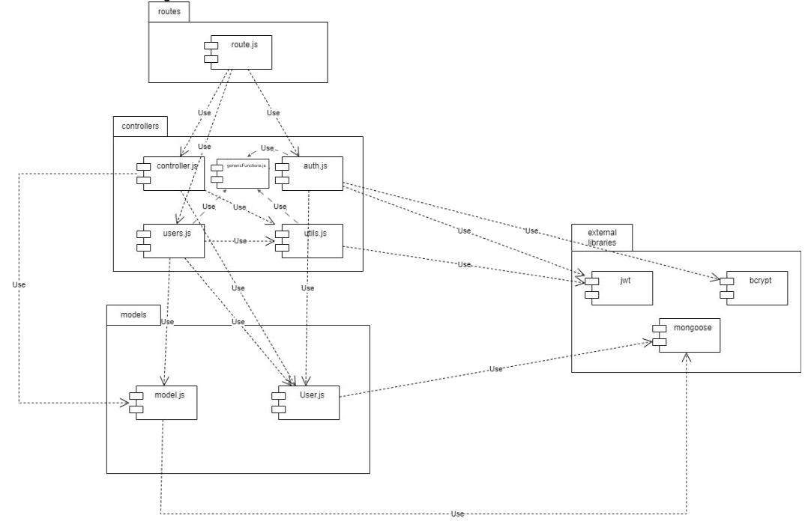

# Test Report

<The goal of this document is to explain how the application was tested, detailing how the test cases were defined and what they cover>

# Contents

- [Test Report](#test-report)
- [Contents](#contents)
- [Dependency graph](#dependency-graph)
- [Integration approach](#integration-approach)
- [Tests](#tests)
- [Coverage](#coverage)
  - [Coverage of FR](#coverage-of-fr)
  - [Coverage white box](#coverage-white-box)

# Dependency graph 
   
# Integration approach
    
    Bottom-up integration: in this approach, integration starts with the lowest-level modules and progresses upwards. The independent modules are integrated first, followed by the main modules that depend on them. The sequence can be defined as:
    
    Step 1: Unit testing of lower-level functions (Auth.js and Utils.js) and lowest-level modules (models.js and User.js). WB/ statement coverage technique is used to define the test cases, covering all the possible statements.
    Step 2: Unit testing of higher-level functions (controller.js, users.js, and genericFunctions.js). WB/ statement coverage technique is used to define the test cases, covering all the possible statements.
    Step 3: Integration testing of the lower-level modules (models.js and User.js) and higher-level functions (controller.js, users.js, and genericFunctions.js). 
    Step 4: API testing of the routes.js file, verifying the correct interaction between the endpoints, functions, and modules.
    Step 5: System testing of the application, verifying the correct interaction between the endpoints, functions, database, and modules.

# Tests

   <in the table below list the test cases defined For each test report the object tested, the test level (API, integration, unit) and the technique used to define the test case  (BB/ eq partitioning, BB/ boundary, WB/ statement coverage, etc)>   <split the table if needed>

| Test case name                                                                                                          | Object(s) tested                 | Test level  | Technique used          |
|-------------------------------------------------------------------------------------------------------------------------|----------------------------------|-------------|-------------------------|
| Test #1 - wrong date format                                                                                             | handleDateFilterParams           | Unit        | WB - Statement Coverage |
| Test #2 - wrong body                                                                                                    | handleDateFilterParams           | Unit        | WB - Statement Coverage |
| Test #3 - $gte                                                                                                          | handleDateFilterParams           | Unit        | WB - Statement Coverage |
| Test #4 - $lte                                                                                                          | handleDateFilterParams           | Unit        | WB - Statement Coverage |
| Test #5 - $gte and $lte                                                                                                 | handleDateFilterParams           | Unit        | WB - Statement Coverage |
| Test #6 - upTo before from                                                                                              | handleDateFilterParams           | Unit        | WB - Statement Coverage |
| Test #7 - upTo and from - Invalid date                                                                                  | handleDateFilterParams           | Unit        | WB - Statement Coverage |
| Test #8 - upTo - Invalid date                                                                                           | handleDateFilterParams           | Unit        | WB - Statement Coverage |
| Test #9 - upTo - dd > 31                                                                                                | handleDateFilterParams           | Unit        | WB - Statement Coverage |
| Test #10 - upTo - mm > 12                                                                                               | handleDateFilterParams           | Unit        | WB - Statement Coverage |
| Test #11 - wrong leap year                                                                                              | handleDateFilterParams           | Unit        | WB - Statement Coverage |
| Test #12 - dd > 30 for april                                                                                            | handleDateFilterParams           | Unit        | WB - Statement Coverage |
| Test #13 - upTo before from                                                                                             | handleDateFilterParams           | Unit        | WB - Statement Coverage |
| Test #14 - upTo before from                                                                                             | handleDateFilterParams           | Unit        | WB - Statement Coverage |
| Simple authentication                                                                                                   | verifyAuth                       | Unit        | WB - Statement Coverage |
| Simple authentication: missing parameter in the access token error                                                      | verifyAuth                       | Unit        | WB - Statement Coverage |
| Simple authentication: missing parameter in the refresh token error                                                     | verifyAuth                       | Unit        | WB - Statement Coverage |
| Simple authentication: access token expired                                                                             | verifyAuth                       | Unit        | WB - Statement Coverage |
| Simple authentication: access token and refresh token expired                                                           | verifyAuth                       | Unit        | WB - Statement Coverage |
| User authentication                                                                                                     | verifyAuth                       | Unit        | WB - Statement Coverage |
| User authentication: access token expired and correct username                                                          | verifyAuth                       | Unit        | WB - Statement Coverage |
| User authentication: username of token doesnt match the request #1                                                      | verifyAuth                       | Unit        | WB - Statement Coverage |
| User authentication: username of token doesnt match the request #2                                                      | verifyAuth                       | Unit        | WB - Statement Coverage |
| User authentication: access token expired and incorrect username                                                        | verifyAuth                       | Unit        | WB - Statement Coverage |
| Administrator authentication                                                                                            | verifyAuth                       | Unit        | WB - Statement Coverage |
| Administrator authentication: access token expired and refresh role correct                                             | verifyAuth                       | Unit        | WB - Statement Coverage |
| Administrator authentication: role of token doesnt match the request #1                                                 | verifyAuth                       | Unit        | WB - Statement Coverage |
| Administrator authentication: role of token doesnt match the request #2                                                 | verifyAuth                       | Unit        | WB - Statement Coverage |
| Administrator authentication: access token expired and refresh role incorrect                                           | verifyAuth                       | Unit        | WB - Statement Coverage |
| Group authentication                                                                                                    | verifyAuth                       | Unit        | WB - Statement Coverage |
| Group authentication: access token expired and correct email                                                            | verifyAuth                       | Unit        | WB - Statement Coverage |
| Group authentication: email not in emails group error #1                                                                | verifyAuth                       | Unit        | WB - Statement Coverage |
| Group authentication: email not in emails group error #2                                                                | verifyAuth                       | Unit        | WB - Statement Coverage |
| Group authentication: access token expired and incorrect email                                                          | verifyAuth                       | Unit        | WB - Statement Coverage |
| Test #1, $gte                                                                                                           | handleAmountFilterParams         | Unit        | WB - Statement Coverage |
| Test #2, $lte                                                                                                           | handleAmountFilterParams         | Unit        | WB - Statement Coverage |
| Test #3, $gte and $lte                                                                                                  | handleAmountFilterParams         | Unit        | WB - Statement Coverage |
| Test #4, NaN                                                                                                            | handleAmountFilterParams         | Unit        | WB - Statement Coverage |
| Test #5, min bigger than max                                                                                            | handleAmountFilterParams         | Unit        | WB - Statement Coverage |
| Test #6, NaN (min)                                                                                                      | handleAmountFilterParams         | Unit        | WB - Statement Coverage |
| Test #7, NaN (max)                                                                                                      | handleAmountFilterParams         | Unit        | WB - Statement Coverage |
| should handle errors and return a 500 code                                                                              | register                         | Unit        | WB - Statement Coverage |
| should fail if email is not valid                                                                                       | register                         | Unit        | WB - Statement Coverage |
| Regular user registration                                                                                               | register                         | Unit        | WB - Statement Coverage |
| Missing parameters: Error test #1                                                                                       | register                         | Unit        | WB - Statement Coverage |
| Missing parameters: Error test #2                                                                                       | register                         | Unit        | WB - Statement Coverage |
| Already existing username: Error test #1                                                                                | register                         | Unit        | WB - Statement Coverage |
| Already existing email: Error test #1                                                                                   | register                         | Unit        | WB - Statement Coverage |
| should handle errors and return a 500 code                                                                              | registerAdmin                    | Unit        | WB - Statement Coverage |
| should fail if email is not valid                                                                                       | registerAdmin                    | Unit        | WB - Statement Coverage |
| Regular admin registration                                                                                              | registerAdmin                    | Unit        | WB - Statement Coverage |
| Missing parameters: Error test #1                                                                                       | registerAdmin                    | Unit        | WB - Statement Coverage |
| Missing parameters: Error test #2                                                                                       | registerAdmin                    | Unit        | WB - Statement Coverage |
| Already existing admin username: Error test #1                                                                          | registerAdmin                    | Unit        | WB - Statement Coverage |
| Already existing admin email: Error test #1                                                                             | registerAdmin                    | Unit        | WB - Statement Coverage |
| Log in: Test #1                                                                                                         | login                            | Unit        | WB - Statement Coverage |
| Log in error test: Missing parameters #1                                                                                | login                            | Unit        | WB - Statement Coverage |
| Log in error test: Missing parameters #2                                                                                | login                            | Unit        | WB - Statement Coverage |
| Invalid email                                                                                                           | login                            | Unit        | WB - Statement Coverage |
| Log in error test: User not found #1                                                                                    | login                            | Unit        | WB - Statement Coverage |
| Log in error test: Password mismatch #1                                                                                 | login                            | Unit        | WB - Statement Coverage |
| Log out: Test #1                                                                                                        | logout                           | Unit        | WB - Statement Coverage |
| Log out error test: User not found #1                                                                                   | logout                           | Unit        | WB - Statement Coverage |
| Log out error test: User not found #2                                                                                   | logout                           | Unit        | WB - Statement Coverage |
| Successful User [createCategory] - Test #1                                                                              | createCategory                   | Unit        | WB - Statement Coverage |
| Unauthorized User [createCategory] - Test #2                                                                            | createCategory                   | Unit        | WB - Statement Coverage |
| Missing attributes [createCategory] - Test #3                                                                           | createCategory                   | Unit        | WB - Statement Coverage |
| Empty string attribute [createCategory] - Test #4                                                                       | createCategory                   | Unit        | WB - Statement Coverage |
| Existing category [createCategory] - Test #5                                                                            | createCategory                   | Unit        | WB - Statement Coverage |
| Missing access token [createCategory] - Test #6                                                                         | createCategory                   | Unit        | WB - Statement Coverage |
| Missing attributes (empty string) [updateCategory] - Test #1                                                            | updateCategory                   | Unit        | WB - Statement Coverage |
| Missing attributes (no body) [updateCategory] - Test #2                                                                 | updateCategory                   | Unit        | WB - Statement Coverage |
| Category does not exist [updateCategory] - Test #3                                                                      | updateCategory                   | Unit        | WB - Statement Coverage |
| New category type already defined [updateCategory] - Test #4                                                            | updateCategory                   | Unit        | WB - Statement Coverage |
| Admin auth [updateCategory] - Test #5                                                                                   | updateCategory                   | Unit        | WB - Statement Coverage |
| Success [updateCategory] - Test #6                                                                                      | updateCategory                   | Unit        | WB - Statement Coverage |
| Wrong color format [updateCategory] - Test #7                                                                           | updateCategory                   | Unit        | WB - Statement Coverage |
| Mismatched types [updateCategory] - Test #8                                                                             | updateCategory                   | Unit        | WB - Statement Coverage |
| No access token [updateCategory] - Test #9                                                                              | updateCategory                   | Unit        | WB - Statement Coverage |
| Missing attributes [deleteCategory] - Test #1                                                                           | deleteCategory                   | Unit        | WB - Statement Coverage |
| Only one category [deleteCategory] - Test #2                                                                            | deleteCategory                   | Unit        | WB - Statement Coverage |
| Empty string [deleteCategory] - Test #3                                                                                 | deleteCategory                   | Unit        | WB - Statement Coverage |
| Category does not exist [deleteCategory] - Test #4                                                                      | deleteCategory                   | Unit        | WB - Statement Coverage |
| Success N>T [deleteCategory] - Test #5                                                                                  | deleteCategory                   | Unit        | WB - Statement Coverage |
| Success N=T [deleteCategory] - Test #6                                                                                  | deleteCategory                   | Unit        | WB - Statement Coverage |
| Unauthorized [deleteCategory] - Test #7                                                                                 | deleteCategory                   | Unit        | WB - Statement Coverage |
| Empty array [deleteCategory] - Test #8                                                                                  | deleteCategory                   | Unit        | WB - Statement Coverage |
| Unauthorized (no access token) [deleteCategory] - Test #9                                                               | deleteCategory                   | Unit        | WB - Statement Coverage |
| Fail N < T [deleteCategory] - Test #10                                                                                  | deleteCategory                   | Unit        | WB - Statement Coverage |
| Successful Request [getCategories] - Test #1                                                                            | getCategories                    | Unit        | WB - Statement Coverage |
| Unauthorized Request [getCategories] - Test #2                                                                          | getCategories                    | Unit        | WB - Statement Coverage |
| Empty Request [getCategories] - Test #3                                                                                 | getCategories                    | Unit        | WB - Statement Coverage |
| Unauthorized Request (no accessToken) [getCategories] - Test #4                                                         | getCategories                    | Unit        | WB - Statement Coverage |
| Generic error [getCategories] - Test #5                                                                                 | getCategories                    | Unit        | WB - Statement Coverage |
| Successful transaction creation by user [createTransaction] - Unit Test #1                                              | createTransaction                | Unit        | WB - Statement Coverage |
| Unauthorized transaction creation by user [createTransaction] - Unit Test #2                                            | createTransaction                | Unit        | WB - Statement Coverage |
| Different user request by user [createTransaction] - Unit Test #3                                                       | createTransaction                | Unit        | WB - Statement Coverage |
| Successful admin transaction creation for different user [createTransaction] - Unit Test #4                             | createTransaction                | Unit        | WB - Statement Coverage |
| Invalid parameters [createTransaction] - Unit Test #5                                                                   | createTransaction                | Unit        | WB - Statement Coverage |
| Database Error Transaction Request [createTransaction] - Unit Test #6                                                   | createTransaction                | Unit        | WB - Statement Coverage |
| User or Category not found [createTransaction] - Unit Test #7                                                           | createTransaction                | Unit        | WB - Statement Coverage |
| Successful Request [getAllTransactions] - Unit Test #1                                                                  | getAllTransactions               | Unit        | WB - Statement Coverage |
| Unauthorized Request [getAllTransactions] - Unit Test #2                                                                | getAllTransactions               | Unit        | WB - Statement Coverage |
| Empty Request [getAllTransactions] - Unit Test #3                                                                       | getAllTransactions               | Unit        | WB - Statement Coverage |
| Database Error Request [getAllTransactions] - Unit Test #4                                                              | getAllTransactions               | Unit        | WB - Statement Coverage |
| Successful User Request [getTransactionsByUser] - Unit Test #1                                                          | getTransactionsByUser            | Unit        | WB - Statement Coverage |
| Unauthorized User Request [getTransactionsByUser] - Unit Test #2                                                        | getTransactionsByUser            | Unit        | WB - Statement Coverage |
| Successful Admin Request [getTransactionsByUser] - Unit Test #3                                                         | getTransactionsByUser            | Unit        | WB - Statement Coverage |
| Unauthorized Admin Request [getTransactionsByUser] - Unit Test #3                                                       | getTransactionsByUser            | Unit        | WB - Statement Coverage |
| Inexistent User Request [getTransactionsByUser] - Unit Test #4                                                          | getTransactionsByUser            | Unit        | WB - Statement Coverage |
| Database Error Request [getTransactionsByUser] - Unit Test #5                                                           | getTransactionsByUser            | Unit        | WB - Statement Coverage |
| Successful User Request [getTransactionsByUserByCategory] - Unit Test #1                                                | getTransactionsByUserByCategory  | Unit        | WB - Statement Coverage |
| Unauthorized User Request [getTransactionsByUserByCategory] - Unit Test #2                                              | getTransactionsByUserByCategory  | Unit        | WB - Statement Coverage |
| Successful Admin Request [getTransactionsByUserByCategory] - Unit Test #3                                               | getTransactionsByUserByCategory  | Unit        | WB - Statement Coverage |
| Unauthorized Admin Request [getTransactionsByUserByCategory] - Unit Test #4                                             | getTransactionsByUserByCategory  | Unit        | WB - Statement Coverage |
| User not found Request [getTransactionsByUserByCategory] - Unit Test #5                                                 | getTransactionsByUserByCategory  | Unit        | WB - Statement Coverage |
| Category not found [getTransactionsByUserByCategory] - Unit Test #1                                                     | getTransactionsByUserByCategory  | Unit        | WB - Statement Coverage |
| Database Error Request [getTransactionsByUserByCategory] - Unit Test #6                                                 | getTransactionsByUserByCategory  | Unit        | WB - Statement Coverage |
| Successful User Request [getTransactionsByGroup] - Unit Test #1                                                         | getTransactionsByGroup           | Unit        | WB - Statement Coverage |
| Unauthorized User Request [getTransactionsByGroup] - Unit Test #2                                                       | getTransactionsByGroup           | Unit        | WB - Statement Coverage |
| Successful Admin Request [getTransactionsByGroup] - Unit Test #3                                                        | getTransactionsByGroup           | Unit        | WB - Statement Coverage |
| Unauthorized Admin Request [getTransactionsByGroup] - Unit Test #4                                                      | getTransactionsByGroup           | Unit        | WB - Statement Coverage |
| Inexistent Group Request [getTransactionsByGroup] - Unit Test #5                                                        | getTransactionsByGroup           | Unit        | WB - Statement Coverage |
| Database Error (Group) Request [getTransactionsByGroup] - Unit Test #6                                                  | getTransactionsByGroup           | Unit        | WB - Statement Coverage |
| Database Error (User) Request [getTransactionsByGroup] - Unit Test #7                                                   | getTransactionsByGroup           | Unit        | WB - Statement Coverage |
| Database Error (Aggregate) Request [getTransactionsByGroup] - Unit Test #8                                              | getTransactionsByGroup           | Unit        | WB - Statement Coverage |
| Successful User Request [getTransactionsByGroupByCategory] - Unit Test #1                                               | getTransactionsByGroupByCategory | Unit        | WB - Statement Coverage |
| Unauthorized User Request [getTransactionsByGroupByCategory] - Unit Test #2                                             | getTransactionsByGroupByCategory | Unit        | WB - Statement Coverage |
| Successful Admin Request [getTransactionsByGroupByCategory] - Unit Test #3                                              | getTransactionsByGroupByCategory | Unit        | WB - Statement Coverage |
| Unauthorized Admin Request [getTransactionsByGroupByCategory] - Unit Test #4                                            | getTransactionsByGroupByCategory | Unit        | WB - Statement Coverage |
| Group not found Request [getTransactionsByGroupByCategory] - Unit Test #5                                               | getTransactionsByGroupByCategory | Unit        | WB - Statement Coverage |
| Category not found Request [getTransactionsByGroupByCategory] - Unit Test #1                                            | getTransactionsByGroupByCategory | Unit        | WB - Statement Coverage |
| Database Error (Group) Request [getTransactionsByGroupByCategory] - Unit Test #6                                        | getTransactionsByGroupByCategory | Unit        | WB - Statement Coverage |
| Database Error (User) Request [getTransactionsByGroupByCategory] - Unit Test #7                                         | getTransactionsByGroupByCategory | Unit        | WB - Statement Coverage |
| Database Error (Aggregate) Request [getTransactionsByGroupByCategory] - Unit Test #8                                    | getTransactionsByGroupByCategory | Unit        | WB - Statement Coverage |
| Successful User Delete Transaction [deleteTransaction] - Unit Test #1                                                   | deleteTransaction                | Unit        | WB - Statement Coverage |
| Unauthorized User [deleteTransaction] - Unit Test #2                                                                    | deleteTransaction                | Unit        | WB - Statement Coverage |
| User or transaction not found [deleteTransaction] - Unit Test #3                                                        | deleteTransaction                | Unit        | WB - Statement Coverage |
| Successful Admin transaction for different users [deleteTransaction] - Unit Test #4                                     | deleteTransaction                | Unit        | WB - Statement Coverage |
| Missing transaction attributes [deleteTransaction] - Unit Test #5                                                       | deleteTransaction                | Unit        | WB - Statement Coverage |
| Database Error Transaction Request [deleteTransaction] - Unit Test #6                                                   | deleteTransaction                | Unit        | WB - Statement Coverage |
| Successful Request [deleteTransactions] - Unit Test #1                                                                  | deleteTransactions               | Unit        | WB - Statement Coverage |
| Unauthorized Request [deleteTransactions] - Unit Test #2                                                                | deleteTransactions               | Unit        | WB - Statement Coverage |
| Invalid ID [deleteTransactions] - Unit Test #3                                                                          | deleteTransactions               | Unit        | WB - Statement Coverage |
| Empty Request [deleteTransactions] - Unit Test #3                                                                       | deleteTransactions               | Unit        | WB - Statement Coverage |
| Database Error Request [deleteTransactions] - Unit Test #4                                                              | deleteTransactions               | Unit        | WB - Statement Coverage |
| should handle errors and return a 500 code                                                                              | getUsers                         | Unit        | WB - Statement Coverage |
| should return empty list if there are no users                                                                          | getUsers                         | Unit        | WB - Statement Coverage |
| should retrieve list of all users                                                                                       | getUsers                         | Unit        | WB - Statement Coverage |
| should be unauthorized if caller is not admin                                                                           | getUsers                         | Unit        | WB - Statement Coverage |
| should handle errors and return a 500 code                                                                              | getUser                          | Unit        | WB - Statement Coverage |
| should return caller user info                                                                                          | getUser                          | Unit        | WB - Statement Coverage |
| should return info of requested user if caller is admin                                                                 | getUser                          | Unit        | WB - Statement Coverage |
| should fail if user does not exist                                                                                      | getUser                          | Unit        | WB - Statement Coverage |
| should fail if Regular user requests other users info                                                                   | getUser                          | Unit        | WB - Statement Coverage |
| should handle errors and return a 500 code                                                                              | createGroup                      | Unit        | WB - Statement Coverage |
| should create a new group                                                                                               | createGroup                      | Unit        | WB - Statement Coverage |
| should fail if user is not authenticated                                                                                | createGroup                      | Unit        | WB - Statement Coverage |
| should fail if missing attributes                                                                                       | createGroup                      | Unit        | WB - Statement Coverage |
| should fail if name is an empty string                                                                                  | createGroup                      | Unit        | WB - Statement Coverage |
| should fail if an email is an empty string or invalid                                                                   | createGroup                      | Unit        | WB - Statement Coverage |
| should fail if calling user is already in a group                                                                       | createGroup                      | Unit        | WB - Statement Coverage |
| should fail if all the members either do not exist or are already in a group                                            | createGroup                      | Unit        | WB - Statement Coverage |
| should fail if a group with the same name already exists                                                                | createGroup                      | Unit        | WB - Statement Coverage |
| should handle errors and return a 500 code                                                                              | getGroups                        | Unit        | WB - Statement Coverage |
| should fail if caller is not an Admin                                                                                   | getGroups                        | Unit        | WB - Statement Coverage |
| should return all the groups                                                                                            | getGroups                        | Unit        | WB - Statement Coverage |
| should handle errors and return a 500 code                                                                              | getGroup                         | Unit        | WB - Statement Coverage |
| should return own group info                                                                                            | getGroup                         | Unit        | WB - Statement Coverage |
| should return any group info if Admin                                                                                   | getGroup                         | Unit        | WB - Statement Coverage |
| should fail if group does not exist                                                                                     | getGroup                         | Unit        | WB - Statement Coverage |
| should fail if not authenticated as Group                                                                               | getGroup                         | Unit        | WB - Statement Coverage |
| should handle errors and return a 500 code                                                                              | addToGroup                       | Unit        | WB - Statement Coverage |
| should add users to own group (User)                                                                                    | addToGroup                       | Unit        | WB - Statement Coverage |
| should add users to a group (Admin)                                                                                     | addToGroup                       | Unit        | WB - Statement Coverage |
| should not add users to a group and suggests to change api (Admin)                                                      | addToGroup                       | Unit        | WB - Statement Coverage |
| should fail if user is not part of the group                                                                            | addToGroup                       | Unit        | WB - Statement Coverage |
| should fail if insert is called by a Regular user                                                                       | addToGroup                       | Unit        | WB - Statement Coverage |
| should fail if group does not exist                                                                                     | addToGroup                       | Unit        | WB - Statement Coverage |
| should fail if missing fields in the body                                                                               | addToGroup                       | Unit        | WB - Statement Coverage |
| should fail if all the members either do not exist or are already in a group (Group)                                    | addToGroup                       | Unit        | WB - Statement Coverage |
| should fail if all the members either do not exist or are already in a group (Admin)                                    | addToGroup                       | Unit        | WB - Statement Coverage |
| should fail if at least one email is not in a valid format or is an empty string                                        | addToGroup                       | Unit        | WB - Statement Coverage |
| should handle errors and return a 500 code                                                                              | removeFromGroup                  | Unit        | WB - Statement Coverage |
| should remove a member of own group (User)                                                                              | removeFromGroup                  | Unit        | WB - Statement Coverage |
| should remove a member of a group (Admin)                                                                               | removeFromGroup                  | Unit        | WB - Statement Coverage |
| should not add users to a group and suggests to change api (Admin)                                                      | removeFromGroup                  | Unit        | WB - Statement Coverage |
| should fail if the user is not part of the group (Group)                                                                | removeFromGroup                  | Unit        | WB - Statement Coverage |
| should fail if user is not an admin                                                                                     | removeFromGroup                  | Unit        | WB - Statement Coverage |
| should fail if group does not exist                                                                                     | removeFromGroup                  | Unit        | WB - Statement Coverage |
| shoud fail if request body does not contain all the necessary attributes                                                | removeFromGroup                  | Unit        | WB - Statement Coverage |
| should fail if at least one email is an empty string is not valid                                                       | removeFromGroup                  | Unit        | WB - Statement Coverage |
| should fail if all the members either do not exist or not in the group                                                  | removeFromGroup                  | Unit        | WB - Statement Coverage |
| should fail if group contains only one member                                                                           | removeFromGroup                  | Unit        | WB - Statement Coverage |
| should handle errors and return a 500 code                                                                              | deleteUser                       | Unit        | WB - Statement Coverage |
| should fail if the user is not an admin                                                                                 | deleteUser                       | Unit        | WB - Statement Coverage |
| shoud delete user succesfully and delete the group because last one                                                     | deleteUser                       | Unit        | WB - Statement Coverage |
| should fail if missing attributes in the body                                                                           | deleteUser                       | Unit        | WB - Statement Coverage |
| should fail if email is not valid or is an empty string                                                                 | deleteUser                       | Unit        | WB - Statement Coverage |
| should fail if email do not belongs to any user in the database                                                         | deleteUser                       | Unit        | WB - Statement Coverage |
| should delete the user and update the database if is not the last one                                                   | deleteUser                       | Unit        | WB - Statement Coverage |
| should delete the user that not belongs to any group                                                                    | deleteUser                       | Unit        | WB - Statement Coverage |
| should handle errors and return a 500 code                                                                              | deleteGroup                      | Unit        | WB - Statement Coverage |
| should fail if user is not an admin                                                                                     | deleteGroup                      | Unit        | WB - Statement Coverage |
| should fail if missing name or is an empty string                                                                       | deleteGroup                      | Unit        | WB - Statement Coverage |
| should fail if group does not exist                                                                                     | deleteGroup                      | Unit        | WB - Statement Coverage |
| should delete the group                                                                                                 | deleteGroup                      | Unit        | WB - Statement Coverage |
| Dummy test, change it                                                                                                   | handleDateFilterParams           | Integration | BB - Bottom up          |
| Simple authentication                                                                                                   | verifyAuth                       | Integration | BB - Bottom up          |
| Simple authentication: missing parameter in the access token error                                                      | verifyAuth                       | Integration | BB - Bottom up          |
| Simple authentication: missing parameter in the refresh token error                                                     | verifyAuth                       | Integration | BB - Bottom up          |
| Simple authentication: missing parameter in the refresh token error                                                     | verifyAuth                       | Integration | BB - Bottom up          |
| User authentication                                                                                                     | verifyAuth                       | Integration | BB - Bottom up          |
| User authentication: access token expired and correct username                                                          | verifyAuth                       | Integration | BB - Bottom up          |
| User authentication: username of token doesnt match the request #1                                                      | verifyAuth                       | Integration | BB - Bottom up          |
| User authentication: username of token doesnt match the request #2                                                      | verifyAuth                       | Integration | BB - Bottom up          |
| User authentication: access token expired and incorrect username                                                        | verifyAuth                       | Integration | BB - Bottom up          |
| Administrator authentication                                                                                            | verifyAuth                       | Integration | BB - Bottom up          |
| Administrator authentication: access token expired and correct role                                                     | verifyAuth                       | Integration | BB - Bottom up          |
| Administrator authentication: role of token doesnt match the request #1                                                 | verifyAuth                       | Integration | BB - Bottom up          |
| Administrator authentication: role of token doesnt match the request #2                                                 | verifyAuth                       | Integration | BB - Bottom up          |
| Administrator authentication: access token expired and incorrect role                                                   | verifyAuth                       | Integration | BB - Bottom up          |
| Group authentication                                                                                                    | verifyAuth                       | Integration | BB - Bottom up          |
| Group authentication: access token expired and correct email                                                            | verifyAuth                       | Integration | BB - Bottom up          |
| Group authentication: email not in emails group error #1                                                                | verifyAuth                       | Integration | BB - Bottom up          |
| Group authentication: email not in emails group error #2                                                                | verifyAuth                       | Integration | BB - Bottom up          |
| Group authentication: access token expired and incorrect email                                                          | verifyAuth                       | Integration | BB - Bottom up          |
| Dummy test, change it                                                                                                   | handleAmountFilterParams         | Integration | BB - Bottom up          |
| Regular user registration: Test #1                                                                                      | register                         | Integration | BB - Bottom up          |
| Missing parameters: Error test #1                                                                                       | register                         | Integration | BB - Bottom up          |
| Missing parameters: Error test #2                                                                                       | register                         | Integration | BB - Bottom up          |
| Already existing username: Error test #1                                                                                | register                         | Integration | BB - Bottom up          |
| Already existing email: Error test #1                                                                                   | register                         | Integration | BB - Bottom up          |
| Regular admin registration: Test #1                                                                                     | registerAdmin                    | Integration | BB - Bottom up          |
| Missing parameters: Error test #1                                                                                       | registerAdmin                    | Integration | BB - Bottom up          |
| Missing parameters: Error test #2                                                                                       | registerAdmin                    | Integration | BB - Bottom up          |
| Already existing admin username Pippo: Error test #1                                                                    | registerAdmin                    | Integration | BB - Bottom up          |
| Already existing admin email: Error test #1                                                                             | registerAdmin                    | Integration | BB - Bottom up          |
| Log in: Test #1                                                                                                         | login                            | Integration | BB - Bottom up          |
| Log in error test: Missing parameters #1                                                                                | login                            | Integration | BB - Bottom up          |
| Log in error test: Missing parameters #2                                                                                | login                            | Integration | BB - Bottom up          |
| Log in error test: User not found #1                                                                                    | login                            | Integration | BB - Bottom up          |
| Log in error test: Password mismatch #1                                                                                 | login                            | Integration | BB - Bottom up          |
| Log out: Test #1                                                                                                        | logout                           | Integration | BB - Bottom up          |
| Log out error test: User not found #1                                                                                   | logout                           | Integration | BB - Bottom up          |
| Log out error test: User not found #2                                                                                   | logout                           | Integration | BB - Bottom up          |
| Category created by admin                                                                                               | createCategory                   | Integration | BB - Bottom up          |
| Category created by unauthorized user                                                                                   | createCategory                   | Integration | BB - Bottom up          |
| Missing attributes #1 [empty string]                                                                                    | createCategory                   | Integration | BB - Bottom up          |
| Category already exist                                                                                                  | createCategory                   | Integration | BB - Bottom up          |
| Missing attributes #2 [missing part]                                                                                    | createCategory                   | Integration | BB - Bottom up          |
| No access token                                                                                                         | createCategory                   | Integration | BB - Bottom up          |
| Category created by unauthorized user                                                                                   | updateCategory                   | Integration | BB - Bottom up          |
| Missing attributes #1 [empty string]                                                                                    | updateCategory                   | Integration | BB - Bottom up          |
| Missing attributes #2 [missing argument]                                                                                | updateCategory                   | Integration | BB - Bottom up          |
| New type refers to existing category                                                                                    | updateCategory                   | Integration | BB - Bottom up          |
| Route exists, category doesnt                                                                                           | updateCategory                   | Integration | BB - Bottom up          |
| Success                                                                                                                 | updateCategory                   | Integration | BB - Bottom up          |
| Missing access token                                                                                                    | updateCategory                   | Integration | BB - Bottom up          |
| Category created by unauthorized user                                                                                   | deleteCategory                   | Integration | BB - Bottom up          |
| Empty array                                                                                                             | deleteCategory                   | Integration | BB - Bottom up          |
| Missing array                                                                                                           | deleteCategory                   | Integration | BB - Bottom up          |
| Empty string in array                                                                                                   | deleteCategory                   | Integration | BB - Bottom up          |
| One category in array does not exist                                                                                    | deleteCategory                   | Integration | BB - Bottom up          |
| One category in db                                                                                                      | deleteCategory                   | Integration | BB - Bottom up          |
| Success N>T                                                                                                             | deleteCategory                   | Integration | BB - Bottom up          |
| Success N==T                                                                                                            | deleteCategory                   | Integration | BB - Bottom up          |
| Category created by unauthorized user (missing accessToken)                                                             | deleteCategory                   | Integration | BB - Bottom up          |
| Fail N < T                                                                                                              | deleteCategory                   | Integration | BB - Bottom up          |
| Retrieved all categories                                                                                                | getCategories                    | Integration | BB - Bottom up          |
| Unauthorized user                                                                                                       | getCategories                    | Integration | BB - Bottom up          |
| Retrieved empty array                                                                                                   | getCategories                    | Integration | BB - Bottom up          |
| No access token                                                                                                         | getCategories                    | Integration | BB - Bottom up          |
| Transaction created by user [createTransaction] - Integration Test #1                                                   | createTransaction                | Integration | BB - Bottom up          |
| Different url [createTransaction] - Integration Test #2                                                                 | createTransaction                | Integration | BB - Bottom up          |
| Invalid parameters [createTransaction] - Integration Test #3                                                            | createTransaction                | Integration | BB - Bottom up          |
| Category dosent exist [createTransaction] - Integration Test #4                                                         | createTransaction                | Integration | BB - Bottom up          |
| Unauthorized User [createTransaction] - Integration Test #5                                                             | createTransaction                | Integration | BB - Bottom up          |
| Transaction created by admin [createTransaction] - Integration Test #6                                                  | createTransaction                | Integration | BB - Bottom up          |
| Transaction for another user created by admin [createTransaction] - Integration Test #7                                 | createTransaction                | Integration | BB - Bottom up          |
| Retrieved all transactions [getAllTransactions] - Integration Test #1                                                   | getAllTransactions               | Integration | BB - Bottom up          |
| Unauthorized admin [getAllTransactions] - Integration Test #2                                                           | getAllTransactions               | Integration | BB - Bottom up          |
| Successful user request [getTransactionsByUser] - Integration Test #1                                                   | getTransactionsByUser            | Integration | BB - Bottom up          |
| Unauthorized user request [getTransactionsByUser] - Integration Test #2                                                 | getTransactionsByUser            | Integration | BB - Bottom up          |
| Successful admin request [getTransactionsByUser] - Integration Test #3                                                  | getTransactionsByUser            | Integration | BB - Bottom up          |
| Unauthorized admin request [getTransactionsByUser] - Integration Test #4                                                | getTransactionsByUser            | Integration | BB - Bottom up          |
| User not found [getTransactionsByUser] - Integration Test #5                                                            | getTransactionsByUser            | Integration | BB - Bottom up          |
| Successful user request [getTransactionsByUserByCategory] - Integration Test #1                                         | getTransactionsByUserByCategory  | Integration | BB - Bottom up          |
| Unauthorized user request [getTransactionsByUserByCategory] - Integration Test #2                                       | getTransactionsByUserByCategory  | Integration | BB - Bottom up          |
| Successful admin request [getTransactionsByUserByCategory] - Integration Test #3                                        | getTransactionsByUserByCategory  | Integration | BB - Bottom up          |
| Unauthorized admin request [getTransactionsByUserByCategory] - Integration Test #4                                      | getTransactionsByUserByCategory  | Integration | BB - Bottom up          |
| User not found request [getTransactionsByUserByCategory] - Integration Test #5                                          | getTransactionsByUserByCategory  | Integration | BB - Bottom up          |
| Category not found request [getTransactionsByUserByCategory] - Integration Test #6                                      | getTransactionsByUserByCategory  | Integration | BB - Bottom up          |
| Successful user request [getTransactionsByGroup] - Integration Test #1                                                  | getTransactionsByGroup           | Integration | BB - Bottom up          |
| Unauthorized user request [getTransactionsByGroup] - Integration Test #2                                                | getTransactionsByGroup           | Integration | BB - Bottom up          |
| Successful admin request [getTransactionsByGroup] - Integration Test #3                                                 | getTransactionsByGroup           | Integration | BB - Bottom up          |
| Unauthorized admin request [getTransactionsByGroup] - Integration Test #4                                               | getTransactionsByGroup           | Integration | BB - Bottom up          |
| Group not found [getTransactionsByGroup] - Integration Test #5                                                          | getTransactionsByGroup           | Integration | BB - Bottom up          |
| Successful user request [getTransactionsByGroupByCategory] - Integration Test #1                                        | getTransactionsByGroupByCategory | Integration | BB - Bottom up          |
| Unauthorized user request [getTransactionsByGroupByCategory] - Integration Test #2                                      | getTransactionsByGroupByCategory | Integration | BB - Bottom up          |
| Successful admin request [getTransactionsByGroupByCategory] - Integration Test #3                                       | getTransactionsByGroupByCategory | Integration | BB - Bottom up          |
| Unauthorized admin request [getTransactionsByGroupByCategory] - Integration Test #4                                     | getTransactionsByGroupByCategory | Integration | BB - Bottom up          |
| Group not found request [getTransactionsByGroupByCategory] - Integration Test #5                                        | getTransactionsByGroupByCategory | Integration | BB - Bottom up          |
| Category not found request [getTransactionsByGroupByCategory] - Integration Test #6                                     | getTransactionsByGroupByCategory | Integration | BB - Bottom up          |
| Transaction deleted by user [deleteTransaction] - Integration Test #1                                                   | deleteTransaction                | Integration | BB - Bottom up          |
| Transaction deleted by admin [deleteTransaction] - Integration Test #2                                                  | deleteTransaction                | Integration | BB - Bottom up          |
| User not authorized [deleteTransaction] - Integration Test #3                                                           | deleteTransaction                | Integration | BB - Bottom up          |
| User not found [deleteTransaction] - Integration Test #4                                                                | deleteTransaction                | Integration | BB - Bottom up          |
| Transaction not found [deleteTransaction] - Integration Test #5                                                         | deleteTransaction                | Integration | BB - Bottom up          |
| Missing ID [deleteTransaction] - Integration Test #6                                                                    | deleteTransaction                | Integration | BB - Bottom up          |
| Transactions deleted by admin [deleteTransactions] - Integration Test #1                                                | deleteTransactions               | Integration | BB - Bottom up          |
| Unauthorized admin [deleteTransactions] - Integration Test #2                                                           | deleteTransactions               | Integration | BB - Bottom up          |
| Invalid transaction [deleteTransactions] - Integration Test #3                                                          | deleteTransactions               | Integration | BB - Bottom up          |
| Invalid ids [deleteTransactions] - Integration Test #4                                                                  | deleteTransactions               | Integration | BB - Bottom up          |
| should return empty list if ther are no users                                                                           | getUsers                         | Integration | BB - Bottom up          |
| should return list of all users                                                                                         | getUsers                         | Integration | BB - Bottom up          |
| should be not authorized if no cookies are provided                                                                     | getUser                          | Integration | BB - Bottom up          |
| should be not authorized if asking for other user info (Regular user)                                                   | getUser                          | Integration | BB - Bottom up          |
| should get own user info                                                                                                | getUser                          | Integration | BB - Bottom up          |
| should fail if resquested user does not exist (Admin)                                                                   | getUser                          | Integration | BB - Bottom up          |
| should return other user data (Admin)                                                                                   | getUser                          | Integration | BB - Bottom up          |
| should return unauthorized if missing cookies                                                                           | createGroup                      | Integration | BB - Bottom up          |
| should crete a new group                                                                                                | createGroup                      | Integration | BB - Bottom up          |
| should fail if only the caller is a valid user to add and all the members either do not exist or are already in a group | createGroup                      | Integration | BB - Bottom up          |
| should fail if at leas one email is not valid or an empty string                                                        | createGroup                      | Integration | BB - Bottom up          |
| should fail if the group already exists                                                                                 | createGroup                      | Integration | BB - Bottom up          |
| should return unauthorized if missing cookies                                                                           | getGroups                        | Integration | BB - Bottom up          |
| should return unauthorized if called by a Regular user                                                                  | getGroups                        | Integration | BB - Bottom up          |
| should return an empty list if no groups are present                                                                    | getGroups                        | Integration | BB - Bottom up          |
| should return a list of groups                                                                                          | getGroups                        | Integration | BB - Bottom up          |
| should be unauthorized if no cookies ar provided                                                                        | getGroup                         | Integration | BB - Bottom up          |
| should be unauthorized if user does not belongs to the group                                                            | getGroup                         | Integration | BB - Bottom up          |
| should fail if requested group does not exist                                                                           | getGroup                         | Integration | BB - Bottom up          |
| should be authorized also if he does not belong to the group (Admin)                                                    | getGroup                         | Integration | BB - Bottom up          |
| should fail if not admin (insert route)                                                                                 | addToGroup                       | Integration | BB - Bottom up          |
| should fail if user does not belongs to the group                                                                       | addToGroup                       | Integration | BB - Bottom up          |
| should fail if body is missng information                                                                               | addToGroup                       | Integration | BB - Bottom up          |
| should fail if group does not exist                                                                                     | addToGroup                       | Integration | BB - Bottom up          |
| should return the group with added members (Admin route)                                                                | addToGroup                       | Integration | BB - Bottom up          |
| should fail if group does not exist                                                                                     | removeFromGroup                  | Integration | BB - Bottom up          |
| should fail if missing emails in body request                                                                           | removeFromGroup                  | Integration | BB - Bottom up          |
| should fail if user tries to remove member of another group                                                             | removeFromGroup                  | Integration | BB - Bottom up          |
| should fail if user is not an Admin (pull route)                                                                        | removeFromGroup                  | Integration | BB - Bottom up          |
| should fail if all the members either do not exist or not in the group                                                  | removeFromGroup                  | Integration | BB - Bottom up          |
| should fail if the group has only one member before deleting someone                                                    | removeFromGroup                  | Integration | BB - Bottom up          |
| should delete some of requested users                                                                                   | removeFromGroup                  | Integration | BB - Bottom up          |
| should fail if user is not authenticated                                                                                | deleteUser                       | Integration | BB - Bottom up          |
| should fail if user is not an admin                                                                                     | deleteUser                       | Integration | BB - Bottom up          |
| should delete the requested user that belongs to a group and should remove the group as well                            | deleteUser                       | Integration | BB - Bottom up          |
| should delete the requested user                                                                                        | deleteUser                       | Integration | BB - Bottom up          |
| should fail if not authenticated                                                                                        | deleteGroup                      | Integration | BB - Bottom up          |
| should fail if user is not an admin                                                                                     | deleteGroup                      | Integration | BB - Bottom up          |
| should fail if the body does not contain all the necessary attributes                                                   | deleteGroup                      | Integration | BB - Bottom up          |
| should fail if group not found                                                                                          | deleteGroup                      | Integration | BB - Bottom up          |
| should delete the group                                                                                                 | deleteGroup                      | Integration | BB - Bottom up          |

# Coverage

## Coverage of FR

<Report in the following table the coverage of  functional requirements (from official requirements) >

| Functional Requirements covered | Test(s)                                                                     |
|---------------------------------|-----------------------------------------------------------------------------|
| FR1                             | -------------                                                               |
| FR11                            | Successful user registration                                                |
|                                 | Wrong email sent for user registration                                      |
|                                 | Missing parameter for user registration: email                              |
|                                 | Missing parameter for user registration: username                           |
|                                 | Already existing username during user registration                          |
|                                 | Already existing email during user registration                             |
| FR12                            | Successful log in                                                           |
|                                 | Missing parameter for correct log in operation: email                       |
|                                 | Sent an invalid log in email                                                |
|                                 | Email not associated to any user: user not found error                      |
|                                 | Password mismatch during log in                                             |
| FR13                            | Successful log out operation                                                |
|                                 | Sent user is not logged in                                                  |
|                                 | Sent user is not correct                                                    |
| FR14                            | Successful admin registration                                               |
|                                 | Wrong email sent for user registration                                      |
|                                 | Missing parameter for user registration: email                              |
|                                 | Missing parameter for user registration: username                           |
|                                 | Already existing username during user registration                          |
|                                 | Already existing email during user registration                             |
| FR15                            | Database error                                                              |
|                                 | Retrieve an empty list                                                      |
|                                 | Retrieve a list of all users                                                |
|                                 | Unauthorized caller                                                         |
|                                 | Return an empty list                                                        |
| FR16                            | Database error                                                              |
|                                 | Retrieve own info (User)                                                    |
|                                 | Retrieve info of any user (Admin)                                           |
|                                 | User not found                                                              |
|                                 | User requests info of another user                                          |
| FR17                            | Database error                                                              |
|                                 | Called by a regular user                                                    |
|                                 | Delete also the group if last member                                        |
|                                 | Missing request body attributes                                             |
|                                 | Email is valid                                                              |
|                                 | Emails is an empty string                                                   |
|                                 | User not found                                                              |
|                                 | User is a member of a group but not the last one                            |
|                                 | User does not belong to any group                                           |
| FR2                             | -------------                                                               |
| FR21                            | Database error                                                              |
|                                 | Creation of a group                                                         |
|                                 | Unauthorized if not authenticated                                           |
|                                 | Missing request body attributes                                             |
|                                 | Name is an empty string                                                     |
|                                 | Email is valid                                                              |
|                                 | Email is an empty string                                                    |
|                                 | Caller is already in a group                                                |
|                                 | All members either do not exist or are already in a group                   |
|                                 | Duplicated group name                                                       |
| FR22                            | Database error                                                              |
|                                 | Called by regular user                                                      |
|                                 | Retrieve all the groups                                                     |
| FR23                            | Database error                                                              |
|                                 | Retrieve own group info (User)                                              |
|                                 | Retrieve info of any group (Admin)                                          |
|                                 | Group does not exist                                                        |
|                                 | Unauthenticated user                                                        |
| FR24                            | Database error                                                              |
|                                 | Add user to own group (User)                                                |
|                                 | Add user to any group (Admin)                                               |
|                                 | Admin calls wrong API                                                       |
|                                 | User does not belong to the group                                           |
|                                 | User call admin API                                                         |
|                                 | Group does not exist                                                        |
|                                 | Missing request body attributes                                             |
|                                 | All members do not exist or are already in a group                          |
|                                 | Email is valid                                                              |
|                                 | Email is an empty string                                                    |
| FR26                            | Database error                                                              |
|                                 | Remove a member of own group (User)                                         |
|                                 | Remove a member of any group (Admin)                                        |
|                                 | Admin calls wrong API                                                       |
|                                 | User do not belong to the group                                             |
|                                 | User is not an admin                                                        |
|                                 | Group does not exist                                                        |
|                                 | Missing request body attributes                                             |
|                                 | Email is valid                                                              |
|                                 | Email is an empty string                                                    |
|                                 | All the member does not exist or not in group                               |
|                                 | Group contains only one member                                              |
| FR28                            | Database error                                                              |
|                                 | User is not an admin                                                        |
|                                 | Missing name or empty string                                                |
|                                 | Group does not exist                                                        |
|                                 | Delete the group                                                            |
| FR3                             | -------------                                                               |
| FR31                            | Successful transaction creation by user                                     |
|                                 | Unauthorized transaction creation by user                                   |
|                                 | Different user request by user                                              |
|                                 | Successful admin transaction creation for different user                    |
|                                 | Invalid parameters                                                          |
|                                 | Database Error Transaction                                                  |
|                                 | User or Category not found                                                  |
|                                 | Transaction created by user                                                 |
|                                 | Different url                                                               |
|                                 | Invalid parameters                                                          |
|                                 | Category does not exist                                                     |
|                                 | Unauthorized User                                                           |
|                                 | Transaction created by admin                                                |
|                                 | Transaction for another user created by admin                               |
| FR32                            | Successful Request                                                          |
|                                 | Unauthorized Request                                                        |
|                                 | Empty Request                                                               |
|                                 | Database Error Request                                                      |
|                                 | Retrieved all transactions                                                  |
|                                 | Unauthorized admin                                                          |
| FR33                            | Successful User Request                                                     |
|                                 | Unauthorized User Request                                                   |
|                                 | Successful Admin Request                                                    |
|                                 | Unauthorized Admin Request                                                  |
|                                 | Non-existent User Request                                                   |
|                                 | Database Error Request                                                      |
|                                 | Successful user request                                                     |
|                                 | Unauthorized user request                                                   |
|                                 | Unauthorized admin request                                                  |
|                                 | User not found                                                              |
| FR34                            | Successful User Request                                                     |
|                                 | Unauthorized User Request                                                   |
|                                 | Successful Admin Request                                                    |
|                                 | Unauthorized Admin Request                                                  |
|                                 | User not found Request                                                      |
|                                 | Category not found Request                                                  |
|                                 | Database Error Request                                                      |
|                                 | Successful user request                                                     |
|                                 | Unauthorized user request                                                   |
|                                 | Successful admin request                                                    |
|                                 | Unauthorized admin request                                                  |
|                                 | User not found request                                                      |
|                                 | Category not found request                                                  |
| FR35                            | Successful User Request                                                     |
|                                 | Unauthorized User Request                                                   |
|                                 | Successful Admin Request                                                    |
|                                 | Unauthorized Admin Request                                                  |
|                                 | Non-existent Group Request                                                  |
|                                 | Database Error (Group) Request                                              |
|                                 | Database Error (User) Request                                               |
|                                 | Database Error (Aggregate) Request                                          |
|                                 | Successful user request                                                     |
|                                 | Unauthorized user request                                                   |
|                                 | Successful admin request                                                    |
|                                 | Unauthorized admin request                                                  |
|                                 | Group not found                                                             |
| FR36                            | Successful User Request                                                     |
|                                 | Unauthorized User Request                                                   |
|                                 | Successful Admin Request                                                    |
|                                 | Unauthorized Admin Request                                                  |
|                                 | Group not found Request                                                     |
|                                 | Category not found Request                                                  |
|                                 | Database Error (Group) Request                                              |
|                                 | Database Error (User) Request                                               |
|                                 | Database Error (Aggregate) Request                                          |
|                                 | Successful user request                                                     |
|                                 | Unauthorized user request                                                   |
|                                 | Successful admin request                                                    |
|                                 | Unauthorized admin request                                                  |
|                                 | Group not found                                                             |
|                                 | Category not found                                                          |
| FR37                            | Successful User Delete Transaction                                          |
|                                 | Unauthorized User                                                           |
|                                 | User or transaction not found                                               |
|                                 | Successful Admin transaction for different users                            |
|                                 | Missing transaction attributes                                              |
|                                 | Database Error Transaction Request                                          |
|                                 | Transaction deleted by user                                                 |
|                                 | Transaction deleted by admin                                                |
|                                 | User not authorized                                                         |
|                                 | User not found                                                              |
|                                 | Transaction not found                                                       |
|                                 | Missing ID                                                                  |
| FR38                            | Successful Request                                                          |
|                                 | Unauthorized Request                                                        |
|                                 | Invalid ID                                                                  |
|                                 | Empty Request                                                               |
|                                 | Database Error Request                                                      |
|                                 | Transactions deleted by admin                                               |
|                                 | Unauthorized admin                                                          |
|                                 | Invalid transaction                                                         |
|                                 | Invalid ids                                                                 |
| FR4                             | -------------                                                               |
| FR41                            | Successful Request (admin)                                                  |
|                                 | Unauthorized Request (not admin)                                            |
|                                 | Missing Attribute (missing field)                                           |
|                                 | Missing Attribute (empty string)                                            |
|                                 | Category already exists                                                     |
|                                 | Unauthorized Request (missing token)                                        |
| FR42                            | Missing Attribute (empty string)                                            |
|                                 | Missing Attribute (body not provided)                                       |
|                                 | Category to be updated does not exist                                       |
|                                 | New category type refers to a category that already exists                  |
|                                 | Unauthorized Request (not Admin)                                            |
|                                 | Successful Request                                                          |
|                                 | Wrong format for color attribute !(#HEX)                                    |
|                                 | Mismatched types (color or type are not strings)                            |
|                                 | Unauthorized request (missing token)                                        |
| FR43                            | Missing attributes (types to be deleted)                                    |
|                                 | Only one category in DB                                                     |
|                                 | Missing attributes (empty string in array)                                  |
|                                 | One category to be deleted does not exist                                   |
|                                 | Successful Request (N > T) categories are more than the ones to be deleted  |
|                                 | Successful Request (N == T) categories are equal to types to be deleted     |
|                                 | Unauthorized Request (no admin)                                             |
|                                 | Missing Attributes (array types exists but it is empty)                     |
|                                 | Unauthorized Request (missing token)                                        |
|                                 | Failed Request (types to be deleted are more than actual categories)        |
| FR44                            | Successful Request                                                          |
|                                 | Unauthorized Request (no authType)                                          |
|                                 | Unauthorized Request (missing token)                                        |
|                                 | Successful Request (no categories, return empty array)                      |
|                                 | Generic catch of error (400)                                                |

## Coverage white box

Report here the screenshot of coverage values obtained with jest-- coverage 

 

